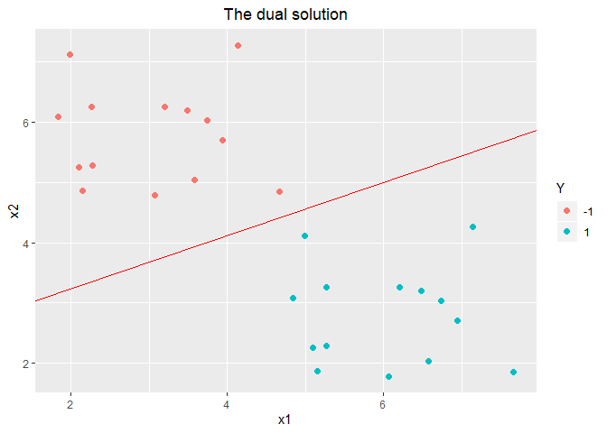

Machine Learning 2019
================
袁欣
2019年6月18日

# 前言

机器学习是对能通过经验自动改进的计算机算法的研究。它是一门多领域的交叉学科，涉及概率论、统计学、逼近论、凸分析、算法复杂度理论论等多门学科。它专门研究计算机怎样模拟或实现人类的学习行为，以获取新的知识或技能，重新组织已有的知识结构使之不断改善自身的性能。它是人工智能的核心，是使计算机具有智能的根本途径，其应用遍及人工智能的各个领域，它主要使用归纳、综合而不是演绎。它的应用已遍及人工智能的各个分支，如专家系统、自动推理、自然语言理解、模式识别、计算机视觉、智能机器人等领域。

机器学习是人工智能研究较为年轻的分支,它的发展过程大体上分为四个时期。第一阶段是20世纪50年代中叶到60年代中叶,属于热烈时期。在这个时期,所研究的是“没有知识”的学习,即“无知”学习。其研究目标是各类自组织系统和自适应系统,其主要研究方法是不断修改系统的控制参数和改进系统的执行能力,不涉及与具体任务有关的知识。本阶段的代表性工作是:塞缪尔(Samuel)的下棋程序。但这种学习的结果远不能满足人们对机器学习系统的期望。第二阶段是在60年代中叶到70年代中叶,被称为机器学习的冷静时期。本阶段的研究目标是模拟人类的概念学习过程,并采用逻辑结构或图结构作为机器内部描述。本阶段的代表性工作有温斯顿(Winston)的结构学习系统和海斯罗思(Hayes-Roth)等的基本逻辑的归纳学习系统。第三阶段从20世纪70年代中叶到80年代中叶,称为复兴时期。在此期间,人们从学习单个概念扩展到学习多个概念,探索不同的学习策略和方法,且在本阶段已开始把学习系统与各种应用结合起来,并取得很大的成功,促进机器学习的发展。1980年,在美国的卡内基—梅隆(CMU)召开了第一届机器学习国际研讨会,标志着机器学习研究已在全世界兴起。

机器学习一般根据处理的数据是否存在人为标注主要分为监督学习和无监督学习。监督学习用有标签的数据作为最终学习目标，通常学习效果好，但获取有标签数据的代价是昂贵的，无监督学习相当于自学习或自助式学习，便于利用更多的数据，同时可能会发现数据中存在的更多模式的先验知识(有时会超过手工标注的模式信息)，但学习效率较低。二者的共性是通过建立数学模型为最优化问题进行求解，通常没有完美的解法。

监督学习的数据集包括初始训练数据和人为标注目标，希望根据标注特征从训练集数据中学习到对象划分的规则，并应用此规则在测试集数据中预测结果，输出有标记的学习方式。因此，监督学习的根本目标是训练机器学习的泛化能力。监督学习的典型算法有：逻辑回归、多层感知机、卷积神经网络等；典型应用有:回归分析、任务分类等。

无监督学习用于处理未被分类标记的样本集数据并且事先不需要进行训练，希望通过学习寻求数据间的内在模式和统计规律，从而获得样本数据的结构特征。因此，无监督学习的根本目标是在学习过程中根据相似性原理进行区分"无监督学习更近似于人类的学习方式，被誉为:人工智能最有价值的地方。无监督学习的典型算法有自动编码器、受限玻尔兹曼机、深度置信网络等；典型应用有:聚类和异常检测等。

本文分为7个章节，分别是引言、模型评估与选择、线性模型、决策树、支持向量机、神经网络、朴素贝叶斯。第二章模型评估与选择主要介绍了查准率、查全率、PR曲线与ROC曲线。第三章线性模型分为两部分，分别是逻辑回归与线性判别分析，并且分别介绍了梯度下降法、牛顿法求解逻辑回归参数值。第四章决策树介绍了经典的ID3、C4.5与CART算法。第五章支持向量机介绍了支持向量机分类与支持向量机回归，其中又详细介绍了支持向量机分类的原问题与对偶问题、高斯核以及支持向量机多分类问题。第六章神经网络介绍了BP反向传播算法估计各神经元参数值与随机梯度下降算法。第七章讲解了朴素贝叶斯算法。各章节的写作结构是从问题出发，然后介绍各算法理论知识，最终编程实现算法。编程软件为R语言。

<!-- 数学虐我千百遍，我待数学如初恋；统计虐我千百遍，我待统计如初恋；概率虐我千百遍，我待概率如初恋；线模虐我千百遍，我待线模如初恋。 -->

<!-- 老师讲完课后，纳尼，老师这节课讲了啥，怎么听得云里雾里的，哎，算了吧，自己下去看吧。 -->

<!-- 当我捧起讲义和课本时，我看了一节，咦，这节讲了点啥，咋啥都没看懂呢？恩，没事，看不懂就再看一遍。好，我又看了一遍，这回有点眉目了，还是没太懂。恩，不着急，那就再看一遍。于是，我又看了一 遍，恩，这回懂得差不多了，还剩个别细节不太懂。 -->

<!-- 看懂了那就做题吧，于是我满怀信心翻开了习题，准备大干一场。咦，第一题啥意思，它要干啥，完全不懂啊，完全不知道它要干啥。没事，再念一遍，再想想。恩，这回看完，想了想，知道它要考啥了，可是还是不会做啊。不着急，翻翻讲义看看书再想想，恩，看完了还是不会做。恩，没事，先做下一道，然后再做这道题，说不定就会做了......... -->

<!-- 第二天，我又捧起了习题，大眼瞪小眼，还是不会做，我好晕啊。没事，不是有答案嘛，看看答案。哇！还好，答案我还能看懂。 -->

<!-- 那些打不倒我们的，终将成为我们的垫脚石！ -->

<!-- [—— By XZZ](https://mp.weixin.qq.com/s/dF9OH92s1h5_27iBNkVYtQ) -->

# 模型评估与选择

## 构造数据集

构造一个包含1000个样本的数据集，按照某种模型对样本排序， 前500个样本中正例（取值1）占90%， 后500个样本中反例（取值0）占80%。

  - 代码如下：

<!-- end list -->

``` r
pred <- c(round(runif(500) / 2 + 0.45),
          round(runif(500) / 2 + 0.10))
```

  - 数据展示：

<!-- end list -->

``` r
head(pred)
```

    ## [1] 1 1 1 1 1 1

``` r
tail(pred)
```

    ## [1] 0 1 1 0 0 0

``` r
mean(pred)
```

    ## [1] 0.542

  - 真实均值：
    \[\bar{pred} = (500 \times 0.9 + 500 \times 0.2) \div 1000 = 0.55\]

## 绘制曲线

试给出该模型的\(P\)-\(R\)曲线和\(ROC\)曲线的代码。

### \(P\)-\(R\) 曲线

  - 理论基础：

对于二分类问题，可将样例根据其真实类别与学习器预测类别的组合划分为真正例(true positive)、 假正例(false
positive)、真反例(true negative)、假反例(false negative)四种情形，对应的混淆矩阵
如下所示<sup>\[1\]</sup>。

``` r
knitr::kable(da)
```

|      | Predict1 | Predict0 |
| ---- | :------- | :------- |
| Act1 | TP       | FN       |
| Act0 | FP       | TN       |

查准率\(P\)与查全率\(R\)的定义分别为： \[P=\frac {TP} {TP + FP} \]
\[R=\frac {TP} {TP + FN} \]

\(F1\) 统计量的定义为： \[F1 = \frac {2\times P\times R} {P + R}\]

我们根据学习器的预测结果对样例进行排序，排在最前面的是学习器认为“最可能”是正例的样本，
排在最后面的是学习器认为“最不可能”的正例样本。按此顺序逐个把样本作为正例预测，每次可计算出
查全率与查准率。以查准率为纵轴，查全率为横轴作图，就可以得到“\(P\)-\(R\)曲线”

**注意：**在1中我们构建的`pred`已经是按照预测概率排序后的数据集(**真实数据的标签**)，所以在接下来我们只需要利用`for`循环计算每一次的\(P\)、\(R\)即可。

  - 构建函数计算\(P\)-\(R\)：

<!-- end list -->

``` r
PRCurve <- function(pred){
  m <- length(pred)
  P <- R <- rep(0, m)
  for(i in 1 : m){
    predi <- c(rep(1, i), rep(0, m - i))
    tab <- table(predi, pred)
    if(i != m){
      P[i] <- tab[2, 2] / (tab[2, 1] + tab[2, 2])
      R[i] <- tab[2, 2] / (tab[1, 2] + tab[2, 2])
    }else{
      P[i] <- tab[1, 2] / (tab[1, 1] + tab[1, 2])
      R[i] <- tab[1, 2] / tab[1, 2]
    }
  }
  F1 <- 2 * P * R / (P + R)
  bound <- which(F1 == max(F1))
  F1 <- max(F1)
  return(list(P = P, R = R, F1 = F1, bound = bound))
}
PR <- PRCurve(pred)
P <- PR$P
R <- PR$R
F1 <- PR$F1
bound <- PR$bound
```

  - 绘制\(P\)-\(R\)曲线：

<!-- end list -->

``` r
library(ggplot2)
da1 <- data.frame(P = P, R = R)
da2 <- data.frame(x = seq(0, 1, 0.01), y = seq(0, 1, 0.01))
ggplot(data = da1, aes(x = R, y = P)) + 
  geom_line(colour = "red") + xlim(0, 1) + ylim(0, 1) +
  geom_line(data = da2, aes(x = x, y = y), colour = "blue") +
  geom_text(data = data.frame(x = 0.5, y = 0.5), aes(x = x, 
            y = y, label = paste("F1=", round(F1, 3))))
```


### \(ROC\) 曲线

  - 理论基础：

\(ROC\) 曲线与 \(P\)-\(R\) 曲线相似，只不过 \(ROC\) 曲线的纵轴为“真正例率”(True Positive
Rate， 简称TPR)，横轴是“假正例率”(False Positive Rate，简称FPR)，两者的定义如下。

\[TPR = \frac {TP} {TP + FN}\] \[FPR = \frac {TP} {TN + FP}\]

若一个机器学习的\(ROC\)曲线被另一个机器学习的曲线完全“包住”，则可断言后者的性能优于前者。当两条曲线发生交叉时，可利用\(ROC\)曲线下的面积\(AUC\)(Area
Under \(ROC\) Curve)判断哪个机器学习的性能更好。

\[AUC = \frac{1}{2} \sum_{i=1}^{m-1} (x_{i+1} - x_i)(y_i + y_{i+1})\]

  - 构建函数计算\(ROC\)：

<!-- end list -->

``` r
ROCCurve <- function(pred){
  m <- length(pred)
  TPR <- FPR <- rep(0, m + 1)
  AUC <- 0
  for(i in 1 : (m - 1)){
    predi <- c(rep(1, i), rep(0, m - i))
    tab <- table(predi, pred)
    TPR[i + 1] <- tab[2, 2] / (tab[1, 2] + tab[2, 2])
    FPR[i + 1] <- tab[2, 1] / (tab[1, 1] + tab[2, 1])
    AUC <- AUC + (1/2) * (TPR[i + 1] + TPR[i]) * 
      (FPR[i + 1] - FPR[i])
  }
  TPR[m + 1] <- 1
  FPR[m + 1] <- 1
  AUC <- AUC + (1/2) * (TPR[m + 1] + TPR[m]) * 
    (FPR[m + 1] - FPR[m])
  return(list(TPR = TPR, FPR = FPR, AUC = AUC))
}
ROC <- ROCCurve(pred)
TPR <- ROC$TPR
FPR <- ROC$FPR
AUC <- ROC$AUC
```

  - 绘制\(ROC\)曲线：

<!-- end list -->

``` r
library(ggplot2)
da1 <- data.frame(TPR = TPR, FPR = FPR)
da2 <- data.frame(x = seq(0, 1, 0.01), y = seq(0, 1, 0.01))
ggplot(data = da1, aes(x = FPR, y = TPR)) + 
  geom_line(colour = "red") + xlim(0, 1) + ylim(0, 1) +
  geom_line(data = da2, aes(x = x, y = y), colour = "blue") +
  geom_text(data = data.frame(x = 0.5, y = 0.5), aes(x = x, 
            y = y, label = paste("AUC=", round(AUC, 3))))
```


## 小结

模型评估与选择的方法还有很多种，如错误率与精度、代价敏感错误率与代价曲线、比较检验、偏差与方差等。在模型评估过程中应因地制宜，根据模型本身制定合适的评价标准。当负例样本占样本集比例较小时（如5%）就不能使用错误率衡量模型的好坏。

# 线性模型

## 西瓜数据

从csv文件中读取西瓜数据，并进行展示。

  - 代码如下：

<!-- end list -->

``` r
wmda <- read.csv(file = "Test2/data/西瓜数据3.0a.csv")
wmda$label <- as.factor(wmda$label)
```

  - 数据展示：

<!-- end list -->

``` r
knitr::kable(head(wmda))
```

| idx | density | sugar | label |
| --: | ------: | ----: | :---- |
|   1 |   0.697 | 0.460 | 1     |
|   2 |   0.774 | 0.376 | 1     |
|   3 |   0.634 | 0.264 | 1     |
|   4 |   0.608 | 0.318 | 1     |
|   5 |   0.556 | 0.215 | 1     |
|   6 |   0.403 | 0.237 | 1     |

``` r
summary(wmda[, -1])
```

    ##     density           sugar        label
    ##  Min.   :0.2430   Min.   :0.0420   0:9  
    ##  1st Qu.:0.4030   1st Qu.:0.1030   1:8  
    ##  Median :0.5930   Median :0.2110        
    ##  Mean   :0.5326   Mean   :0.2128        
    ##  3rd Qu.:0.6570   3rd Qu.:0.2670        
    ##  Max.   :0.7740   Max.   :0.4600

  - 画图：

<!-- end list -->

``` r
ggplot(data = wmda, aes(x = density, y = sugar, color = label)) + 
  geom_point(size = 2.0, shape = 16)
```

<!-- -->

## 逻辑回归简介

### 分类问题

逻辑回归是处理典型分类问题的，如判断一个邮件是否为垃圾邮件(Spam / not Spam)。 逻辑回归与线性回归直观区别是：

线性回归将预测值映射到了实数集(\(h_{\theta}(x)\) can be \> 1 or \< 0); 逻辑回归的预测值仅在\[0,
1\]之间(\(0\le h_{\theta}(x) \le 1\))。

### 假设表示

(Hypothesis Representation)假设表示代表当有一个实际问题时，我们用什么样的方程表示。
逻辑回归是想实现\(0\le h_{\theta}(x) \le 1\)。

那么假设函数就可以是如下形式：

\[h_\theta(x) = g(\theta ^T x)\]

\[g(z)=\dfrac{1}{1+e^{-z}}\]

\[h_\theta(x)=P(y=1|x;\theta)\]

\(h_\theta(x)\)的含义为(Probability that \(y=1\),given \(x\), parameterized
by \(\theta\))

  - \(g(z)\)的图像如下：

<!-- -->

### 决策边界

假设当\(h_\theta(x)\)的值大于等于0.5，预测值\(y=1\);当\(h_\theta(x)\)的值小于0.5时，预测值\(y=0\)。
决策边界就是\(h_\theta(x)=0.5\)，也就是\(\theta^Tx = 0\)。
例如当求得参数\(\theta=[-3; 1; 1]\)，则决策边界为\(x_1+x_2 = 3\)。

非线性决策边界是指当假设函数\(h_\theta(x)\)为非线性函数时的决策边界。 例如当
\(h_\theta(x) = g(\theta_0 + \theta_1x_1 + \theta_2x_2 + \theta_3x_1^2 + \theta_4x_2^2)\)，
\(\theta=[-1; 0;0;1;1]\)，此时的决策边界为\(x_1^2+x_2^2=0\)。

### 代价函数

假设测试集为\(\{(x^{(1)},y^{(1)}), (x^{(2)},y^{(2)}), ... , (x^{(m)},y^{(m)})\}\)，共m个样本。
\(x\in[x_0;x_1;...;x_n]\)，其中\(x_0=1\)，\(y\in\{0,1\}\)。 线性的回归的代价函数为： \[
J_\theta = \dfrac{1}{m}\sum_{i=1}^m \dfrac{1}{2}(h_\theta(x^{(i)})-y^{(i)})^2
\] \[
cost(h_\theta(x), y)=\dfrac{1}{2}(h_\theta(x)-y)^2
\]

然而这个函数在逻辑回归里是\(\theta\)的非凸函数。逻辑回归的代价函数如下式时为凸函数 \[
cost(h_\theta(x), y) =
\begin{cases} 
-log(h_\theta(x)),  & \mbox{if }y\mbox{=1} \\
-log(1-h_\theta(x)), & \mbox{if }y\mbox{=0}
\end{cases}
\]

  - 代价函数的图形如下：

<!-- -->

简化形式为：

\[
cost(h_\theta(x), y) = -ylog(h_\theta(x)) - (1-y)log(1-h_\theta(x))
\] 那么逻辑回归的代价函数就为： \[
J_\theta = \dfrac{1}{m}\sum_{i=1}^m (-y^{(i)}log(h_\theta(x^{(i)})) - 
(1-y^{(i)})log(1-h_\theta(x^{(i)})))
\]

上式来自于极大似然估计，具体推到过程如下： 从假设表示中有提到\(h_\theta(x)\)的含义为(Probability that
\(y=1\),given \(x\), parameterized by \(\theta\))。
利用极大似然法（即令每个样本属于其真实标记的概率越大越好）估计\(\theta\)。
似然函数为： \[
L=\prod_{i=1}^m h_\theta(x^{(i)})^{Y^{(i)}} (1-h_\theta(x^{(i)}))^{1-Y^{(i)}} 
\] \[
lnL = \sum_{i=1}^m Y^{(i)}(ln(h_\theta(x^{(i)}))) + (1-Y^{(i)})(ln(1- h_\theta(x^{(i)})))
\] 求似然函数的最大值等价于求\(J_\theta\)的最小值。

### 梯度下降法

上节中已知\(J_\theta\)，对\(\theta\)求偏导数得：

  - 编程实现逻辑回归的梯度下降算法

<!-- end list -->

``` r
sigmoid <- function(z){
  return(1 / (1 + exp(-z)))
}
gradientDescent <- function(X, y, theta, alpha, num_iters){
  # Initialize some useful values
  m <- length(y) # number of training examples
  J.history <- rep(0, num_iters)
  for(i in 1:num_iters){
    theta <- theta - (1/m) * (t(X) %*% (sigmoid(X %*% theta) - y))
    #  Save the cost J in every iteration    
    J.history[i] <- (1/m) * 
      sum(-y * log(sigmoid(X %*% theta)) - 
            (1-y) * (log(1 - sigmoid(X %*% theta))))
  }
  return(list(theta = theta, J = J.history))
}

X <- as.matrix(wmda[, 2:3])
X <- cbind(1, X)
y <- as.matrix(as.numeric(as.character(wmda$label)))
initial_theta <- matrix(rep(0, 3), ncol = 1)
alpha <- 0.1
Ret <- gradientDescent(X, y, initial_theta, alpha, 
                       num_iters = 5000)
```

  - 回归参数与代价函数曲线如下：

<!-- end list -->

``` r
as.numeric(Ret$theta)
```

    ## [1] -4.419850  3.151482 12.495210

``` r
ggplot(data = data.frame(item = 1:length(Ret$J), J = Ret$J),
       aes(x = item, y = J)) + geom_line()
```

<!-- -->

  - 决策边界如下：

<!-- end list -->

``` r
ggplot(data = wmda, aes(x = density, y = sugar, color = label)) + 
  geom_point(size = 2.0, shape = 16) + 
  geom_abline(slope = -Ret$theta[2] / Ret$theta[3], 
              intercept = -Ret$theta[1]/Ret$theta[3], 
              color = "red")
```

<!-- -->

### mapFeature

从上图可以看到，逻辑回归对西瓜集的分类是较差的。我们也可以直观的看到西瓜集是线性不可分的！所以这里引入了高阶特征，构建非线性边界去划分西瓜集。  
构建方法为选择最高次数，将两变量映射到高阶上形成新特征。例如构建最高幂次为6的特征，此时会产生新特征如：\(x_1^6\)、\(x_2^6\)、\(x_1^5x_2\)、……、\(x_1x_2\)、\(x_2\)、\(x_1\)共28个特征。

  - 构建函数

<!-- end list -->

``` r
mapFeature <- function(x1, x2, degree){
  df <- matrix(1, nrow = length(x1))
  for(i in 1:degree){
    for(j in 0:i){
      x <- x1^(i - j) * x2^(j)
      df <- cbind(df, x)
    }
    
  }
  return(df)
}
x1 <- wmda$density
x2 <- wmda$sugar
X <- mapFeature(x1, x2, 6)
```

### 正则化

如果我们有太多特征，那么通过训练集得到的模型很可能会过拟合，使得模型对新样本的预测值差。为了解决过拟合的问题，提出了正则化（Regularization）。过拟合的问题还可以通过手工选择特征或者通过算法（如PCA）来减少特征数。

正则化的思想是控制参数\(\theta_j\)的大小来防止过拟合。一般来说不对\(\theta_0\)进行正则化。

正则化后的代价函数与偏导数如下所示：

\[
J_\theta = \dfrac{1}{m}\sum_{i=1}^m (-y^{(i)}log(h_\theta(x^{(i)})) - 
(1-y^{(i)})log(1-h_\theta(x^{(i)}))) + \dfrac{\lambda}{2m} \sum_{j=1}^n \theta_j^2
\]

\[
\dfrac{\partial}{\partial \theta_j} J_\theta = \dfrac{1}{m} \sum_{i=1}^m
(h_\theta(x^{(i)}) - y^{(i)})x_j^{(i)} + \dfrac{\lambda}{m} \theta_j
\]

  - 编程实现正则化逻辑回归的梯度下降算法

<!-- end list -->

``` r
gradientDescent <- function(X, y, theta, alpha, num_iters, lambda){
  # Initialize some useful values
  m <- length(y) # number of training examples
  n <- ncol(X)
  J.history <- rep(0, num_iters)
  for(i in 1:num_iters){
    theta[1] <- theta[1] - 
      (1/m) * (t(X[, 1]) %*% (sigmoid(X %*% theta) - y))
    theta[2:n] <- theta[2:n] - 
      (1/m) * (t(X[, 2:n]) %*% (sigmoid(X %*% theta) - y)) + 
      lambda/m * theta[2:n]
    #  Save the cost J in every iteration    
    J.history[i] <- (1/m) * 
      sum(-y * log(sigmoid(X %*% theta)) - 
            (1-y) * (log(1 - sigmoid(X %*% theta)))) + 
      (lambda/2/m) * sum(theta[2:n] ^2)
  }
  return(list(theta = theta, J = J.history))
}

y <- as.matrix(as.numeric(as.character(wmda$label)))
initial_theta <- matrix(rep(0, 28), ncol = 1)
alpha <- 0.1
lambda <- 0
Ret <- gradientDescent(X, y, initial_theta, alpha, 
                       num_iters = 100000, lambda)
```

  - 回归参数、预测精度、代价函数曲线如下：

<!-- end list -->

``` r
as.numeric(Ret$theta)
```

    ##  [1] -18.2576688  55.5141514 -10.7170173 -12.4644799  66.1030944
    ##  [6] -49.1665058 -48.6936829  60.3009426  14.7737220 -32.2204811
    ## [11] -50.7437367  44.6194226  26.2238727   1.2997743 -15.4884559
    ## [16] -37.5326066  32.8471126  24.1358494   9.3827915  -0.7082506
    ## [21]  -6.5816698 -21.6262370  25.2981189  19.6096944   9.8597332
    ## [26]   3.2328093  -0.5628648  -2.6294491

``` r
p <- sigmoid(X %*% Ret$theta)
pos <- which(p >= 0.5)
neg <- which(p < 0.5)
p[pos] <- 1
p[neg] <- 0
t <- table(p, wmda$label)
print(paste("prediction accuracy = ", sum(t) / sum(diag(t)) * 100,
            "%"))
```

    ## [1] "prediction accuracy =  100 %"

``` r
ggplot(data = data.frame(item = 1:length(Ret$J), J = Ret$J),
       aes(x = item, y = J)) + geom_line()
```

<!-- -->

  - 非线性决策边界如下：

<!-- end list -->

``` r
x1 <- seq(0, 0.8, 0.01)
x2 <- seq(0, 0.5, 0.01)
x.grad <- data.frame()
for(i in x1){
  for(j in x2){
    x.grad <- rbind(x.grad, c(i, j))
  }
}
colnames(x.grad) <- c("x1", "x2")
X.grad <- mapFeature(x.grad[, 1], x.grad[, 2], 6) 
p <- sigmoid(X.grad %*% Ret$theta)
idx <- which(p < 0.5+0.01 & p > 0.5-0.01)

ggplot(data = wmda, aes(x = density, y = sugar, color = label)) + 
  geom_point(size = 2.0, shape = 16) + 
  geom_line(data = x.grad[idx, ], aes(x = x1, y = x2),  colour = "red")
```

<!-- -->

### 多分类问题

可以利用One-vs-all算法，创建伪训练集，例如：
预测天气（Sunny、Cloudy、Rain、Snow）,可以学习四个逻辑回归，判断哪个概率最高，则属于哪一类。

### 利用牛顿法求解

牛顿法主要可以求解方程\(f{(\theta)} = 0\)，核心思想是根据泰勒展开式进行迭代求解的。
假设\(f(x)=0\)有近似根\(x_k\)，那么\(f(x)\)在\(x_k\)处的泰勒展开式为： \[
f(x)\approx f(x_k)+f^\prime(x_k)(x-x_k)
\] 令\(f(x)=0\)有 \[
x_{k+1} = x_k - \dfrac{f(x_k)}{f^\prime(x_k)}
\]

在求解代价函数最小化的过程中，我们可以利用牛顿法迭代求解一阶偏导数的解，从而得出参数的估计值。 也就是：

\[
\theta = \theta - \dfrac{J^\prime{(\theta})}{J''(\theta)}
\]

一阶偏导数为： \[
\dfrac{\partial}{\partial \theta_j}J_\theta  = \dfrac{1}{m} \sum_{t=1}^m
(h_\theta(x^{(t)}) - y^{(t)})x_j^{(t)} \nonumber
\]

二阶偏导数（Hessian Matrix）为\(n*n\)的方阵。 下面推倒二阶偏导数：

  - 代码实现

<!-- end list -->

``` r
HessianMatrix <- function(X, y, theta, num_iters){
  # Initialize some useful values
  m <- length(y) # number of training examples
  J.history <- rep(0, num_iters)
  
  for(i in 1:num_iters){
    partial1 <- (1/m) * (t(X) %*% (sigmoid(X %*% theta) - y))
    partial2 <- (1/m) * (t(X) %*% (X * as.numeric(
                           (sigmoid(X %*% theta) * 
                           (1 - sigmoid(X %*% theta))))) )
    theta <- theta - solve(partial2) %*% partial1
    #  Save the cost J in every iteration    
    J.history[i] <- (1/m) * 
      sum(-y * log(sigmoid(X %*% theta)) - 
            (1-y) * (log(1 - sigmoid(X %*% theta))))
  }
  return(list(theta = theta, J = J.history))
}
X <- as.matrix(wmda[, 2:3])
X <- cbind(1, X)
initial_theta <- matrix(rep(0, 3), ncol = 1)
Ret <- HessianMatrix(X, y, initial_theta, num_iters = 10)
```

  - 回归参数、代价函数曲线、决策边界如下：

<!-- end list -->

    ## [1] -4.428865  3.158330 12.521196

<!-- -->

### 牛顿法正则化

  - 代码实现

<!-- end list -->

``` r
HessianMatrix2 <- function(X, y, theta, num_iters, lambda){
  # Initialize some useful values
  m <- length(y) # number of training examples
  n <- ncol(X)
  J.history <- rep(0, num_iters)
  
  for(i in 1:num_iters){
    partial1 <- matrix(rep(0, n))
    partial1[1] <- (1/m) * (t(X[, 1]) %*% (sigmoid(X %*% theta) - y))
    partial1[2:n] <- (1/m) * (t(X[, 2:n]) %*% (sigmoid(X %*% theta) - y)) + 
      lambda/m * theta[2:n]
    
    partial2 <- (1/m) * (t(X) %*% (X * as.numeric(
                           (sigmoid(X %*% theta) * 
                           (1 - sigmoid(X %*% theta))))) )
    theta <- theta - ginv(partial2) %*% partial1
    #  Save the cost J in every iteration    
    J.history[i] <- (1/m) * 
      sum(-y * log(sigmoid(X %*% theta)) - 
            (1-y) * (log(1 - sigmoid(X %*% theta)))) + 
      (lambda/2/m) * sum(theta[2:n] ^2)
  }
  return(list(theta = theta, J = J.history))
}
x1 <- wmda$density
x2 <- wmda$sugar
X <- mapFeature(x1, x2, 6)
y <- as.matrix(as.numeric(as.character(wmda$label)))
initial_theta <- matrix(rep(0, 28), ncol = 1)
lambda <- 0
Ret <- HessianMatrix2(X, y, initial_theta,
                       num_iters = 10, lambda)
```

  - 回归参数、代价函数曲线如下：

<!-- end list -->

    ##  [1]   260.58899 -2305.59070   131.21556  5662.94237  -738.76919
    ##  [6]  -205.44986 -2183.57580  2171.56434  -331.49342   268.51504
    ## [11] -5259.69998   -94.64807  1782.42515  -318.80433  -889.53148
    ## [16]  -933.53588 -2313.77204  1750.42685   388.24622 -1015.93544
    ## [21] -1193.47150  6438.19215 -2860.52426  1047.96320   531.73182
    ## [26]  -599.01104 -1036.47230  -927.34067

    ## [1] "prediction accuracy =  100 %"

<!-- -->

### 小结

1.  对比可以发现牛顿法比梯度下降法收敛速度快的多！

2.  在最小化代价函数的过程中还有很多更高级的方法，如BFGS（共轭梯度）法、L-BGFS等，它们的优点是不用选择参数\(\alpha\)、收敛速度更快，但是它们也更复杂。

3.  在非线性边界画图中利用的是等值线绘图，也就是将图形分成一个个小的密度点，计算每个密度点的概率值。密度点概率值为0.5的等值线即为边界线。但是在实现过程中`geom_isobands()`并不能很好实现这个过程。Matlab可以利用函数`contour()`实现，切记在利用这个函数之前将\(X\)转置。

4.  在HessianMatrix矩阵的求逆过程中并没有利用`solve()`函数，而是利用了`MASS`包里的`ginv`函数，当矩阵不可逆时，这个函数求得矩阵伪逆。类似于Matlab中`inv`与`pinv`的关系。

## 线性判别分析

线性判别分析（Linear Discriminant Anaysis，简称LDA）是一种经典的线性学习方法。
LDA的思想非常朴素：给定训练集，设法将样本投射到一条直线上，使得同类样本的投影点尽可能接近、异类样本投影点尽可能远离；在对新样本进行分类时，将其投影到同样的直线上，再根据投影点的位置来确定新样本的类型。

### 理论基础

将数据点投影到直线\(\theta^T\)上，表达式为 \[
y = \theta^Tx
\]

对于二分类问题，两类样本中心在直线上的投影分别为\(\theta^T \mu_0\)和\(\theta^T \mu_1\)，两类样本投影后的协方差为\(\theta^T \Sigma_0 \theta\)和\(\theta^T \Sigma_1 \theta\)，具体推到公式为：

欲使同类样本的投影点尽可能接近，可以让同类样本的协方差尽可能的小（类似于方差代表样本离散程度），即\(\theta^T \Sigma_0 \theta + \theta^T \Sigma_1 \theta\)尽可能小；而欲使异类样本的投影点尽可能远离，可以让类中心之间的距离尽可能大，即\(||\theta^T\mu_0 - \theta^T\mu_1||_2^2\)尽可能大。同时考虑这两个方面得到如下最大化优化目标：

定义类内散度矩阵（within-class scatter matrix）:

定义类间散度矩阵（between-class scatter matrix）： \[
S_b = (\mu_0 - \mu_1)(\mu_0 - \mu_1)^T
\]

则 \[
J = \dfrac{\theta^TS_b\theta}{\theta^T S_w \theta } 
\]

我们优化的目标就是使\(J\)最大化。注意到上式的分子和分母都是关于\(\theta\)的二次项，因此解仅与\(\theta\)的方向有关。不失一般性，令\(\theta^T S_w \theta = 1\)，则可得到以下优化目标：

\[
\min_\theta -\theta^TS_b\theta
\] \[
s.t.\theta^T S_w \theta = 1
\] 利用拉格朗日乘子法化解上式可得： \[
c(\theta) = \theta^TS_b\theta - \lambda(\theta^T S_w \theta - 1)
\] \[
\dfrac{dc}{d\theta} = 2S_b\theta - 2\lambda S_w\theta = 0
\] \[
S_w^{-1}S_b\theta = \lambda\theta
\] 参数\(\theta\)为矩阵\(S_w^{-1}S_b\)的特征向量。
注意到\(S_b\theta\)的方向恒为\(\mu_0-\mu_1\)，不妨令\(S_b\theta = \lambda(\mu_0 - \mu_1)\)。解释：
\[
S_b\theta = (\mu_0 - \mu_1)(\mu_0 - \mu_1)^T \theta
\] 其中\((\mu_0 - \mu_1)^T \theta\)为一个常数。

最终化简结果为： \[
\theta = S_w^{-1}(\mu_0 - \mu_1)
\]

  - 编程实现

<!-- end list -->

``` r
LDA <- function(X, y){
  pos <- which(y == 1)
  neg <- which(y == 0)
  u1 <- as.matrix(colMeans(X[pos, ]))
  u0 <- as.matrix(colMeans(X[neg, ]))
  Sw <- (t(X[pos, ]) - as.numeric(u1)) %*% t(t(X[pos, ]) - as.numeric(u1)) + 
    (t(X[neg, ]) - as.numeric(u0)) %*% t(t(X[neg, ]) - as.numeric(u0))
  theta <- ginv(Sw) %*% (u0 - u1)
  return(list(u1=u1, u0=u0, theta = theta))
}

X <- as.matrix(wmda[, 2:3])
y <- as.matrix(as.numeric(as.character(wmda$label)))
Ret <- LDA(X, y)
theta <- Ret$theta
print(theta)
```

    ##            [,1]
    ## [1,] -0.1465098
    ## [2,] -0.7387156

<!-- -->

  - 备注：

\(\theta^T\)就是我们得到的直线，在图中展示就是斜率为`theta[2]/theta[1]`,截距为\(0\)的直线。图中的映射线与\(\theta^T\)垂直，我们通过点斜式计算出每一点的映射线，再与直线\(\theta^T\)联立求得每一点在\(\theta^T\)直线上与之相对应的点。
设\(k=\theta_2/\theta_1\)为直线\(\theta^T\)的斜率，则\(\theta^T\)也可以表示为\(y=kx\)。
映射线斜率为\(-1/k\)。下面以一个点为例计算该点在\(y=kx\)上的投影点。 \[
\begin{cases} 
y=kx \\
y-y_i = -1/k(x-x_i)
\end{cases}
\] 解得 \[
x= \dfrac{\dfrac{1}{k}x_i + y_i}{\dfrac{1}{k} + 1};
y= \dfrac{x_i + ky_i}{\dfrac{1}{k} + 1}
\]

### 决策边界

在本节开始中有提到对新样本进行分类时，将其投影到同样的这条直线上，再根据投影点的位置来判断新样本的类别。在这里我们取决策边界为\(\theta^T\mu_0\)与\(\theta^T\mu_1\)的中心。推导得决策边界的斜率为\(-1/k\)，截距为\(\dfrac{1}{k}x_1 + y_1\)。

<!-- -->

### 多分类LDA

假设存在\(N\)个类，且第\(i\)个类的样本数为\(m_i\)。定义“全局散度矩阵”：

其中\(\mu\)为所有样本的均值向量。\(S_w\)重新定义为： \[
S_w = \sum_{i=1}^N \sum_{x\in D_i}(x-\mu_i)(x-\mu_i)^T
\]

则\(S_b\)为：

通过求广义特征值方法求解\(\theta\)。 \[
S_w^{-1}S_b\theta = \lambda\theta
\] \(\theta\)的闭式解是\(S_w^{-1}S_b\)的N-1个最大广义特征值所对应的特征向量组成的矩阵。

### 小结

  - 监督降维

LDA是一种经典的监督式降维技术。PCA是一种无监督的数据降维方法。我们知道即使在训练样本上，我们提供了类别标签，在使用PCA模型的时候，我们是不利用类别标签的，而LDA在进行数据降维的时候是利用数据的类别标签提供的信息的。

从几何的角度来看，PCA和LDA都是将数据投影到新的相互正交的坐标轴上。只不过在投影的过程中他们使用的约束是不同的，也可以说目标是不同的。PCA是将数据投影到方差最大的几个相互正交的方向上，以期待保留最多的样本信息。样本的方差越大表示样本的多样性越好，在训练模型的时候，我们当然希望数据的差别越大越好。否则即使样本很多但是他们彼此相似或者相同，提供的样本信息将相同，相当于只有很少的样本提供信息是有用的。但是，对于一些特殊分布的数据集，PCA的这个投影后方差最大的目标就不太合适了。比如下图：

<!-- -->

  - 奇异值分解

奇异值分解（Singular Value Decomposition,
简称SVD）是在机器学习领域广泛应用的算法，它不光可以用于降维算法中的特征分解，还可以用于推荐系统，以及自然语言处理等领域。

SVD是对矩阵进行分解。假设我们的矩阵A是一个\(m\times n\)的矩阵，那么我们定义矩阵A的SVD为：

\[
A = U\Sigma V^T
\]
其中U是一个\(m\times m\)的矩阵；\(\Sigma\)是一个\(m\times n\)的矩阵，除了主对角线上的元素以外全为0，主对角线上的元素称为奇异值；V是一个\(n\times n\)的矩阵。U和V都是酉矩阵，即满足\(U^TU = I\)，\(V^TV=I\)。下面进行求解。

如果我们将A的转置和A做矩阵乘法，对\(A^TA\)(\(m\times n\))进行特征值分解。 \[
(A^TA)v_i = \lambda_iv_i
\] 这样我们就可以得到矩阵\(A^TA\)的n个特征值和对应的n个特征向量\(v\)了。
**将\(A^TA\)的所有特征向量张成一个\(n\times n\)的矩阵V，就是我们SVD公式里面的V矩阵了，一般我们将V中的每一个特征向量叫做A的右奇异向量。**

同样我们将A和A的转置做矩阵乘法，会得到一个\(m\times m\)的方阵\(AA^T\)。进行特征值分解，然后将所有特征向量张成一个\(m\times m\)的矩阵U，这就是我们SVD公式里面的U矩阵了。一般我们将U中的每一个特征向量叫做A的左奇异向量。

\[
A = U\Sigma V^T \Rightarrow A^T = V\Sigma^TU^T  \Rightarrow A^TA = V\Sigma^2V^T
\]
从上式我们可以看出\(A^TA\)的特征向量张成的矩阵就是我们SVD中的V矩阵。同时也可以看出\(A^TA\)的特征值是奇异值的平方，也就是有：
\[
\sigma_i = \sqrt{\lambda_i}
\]

举例： \[ 
A= 
\begin{bmatrix}
0 & 1 \\
1 & 1 \\
1 & 0 \\
\end{bmatrix}
\]

求得

\[ 
A^TA= 
\begin{bmatrix}
2 & 1 \\
1 & 2 \\
\end{bmatrix}
\] \[ 
AA^T= 
\begin{bmatrix}
1 & 1 & 0\\
1 & 2 & 1\\
0 & 1 & 1\\
\end{bmatrix}
\]

进而求得\(A^TA\)的特征值与特征向量为： \[
\lambda_1=3;v_1 = (\frac{1}{\sqrt{2}};\frac{1}{\sqrt{2}});
\lambda_2=1;v_2 = (-\frac{1}{\sqrt{2}};\frac{1}{\sqrt{2}})
\] \(AA^T\)的特征值与特征向量为：

\[
\lambda_1=3;u_1 = (\frac{1}{\sqrt{6}};\frac{2}{\sqrt{6}};\frac{1}{\sqrt{6}});
\lambda_2=1;u_2 = (\frac{1}{\sqrt{2}};0;-\frac{1}{\sqrt{2}});
\lambda_3=0;u_3 = (\frac{1}{\sqrt{3}};-\frac{1}{\sqrt{3}};\frac{1}{\sqrt{3}})
\]

利用\(\sigma_i = \sqrt{\lambda_i}\)解得，\(\sigma_1 = \sqrt{3},\sigma_2 = 1\)。

最终A的奇异值分解为：

\[
A = U \Sigma V^T = 
\begin{bmatrix}
\frac{1}{\sqrt{6}} & \frac{1}{\sqrt{2}} & \frac{1}{\sqrt{3}}\\
\frac{2}{\sqrt{6}} & 0 & -\frac{1}{\sqrt{3}}\\
\frac{1}{\sqrt{6}} & -\frac{1}{\sqrt{2}} & \frac{1}{\sqrt{3}}\\
\end{bmatrix}
\begin{bmatrix}
\sqrt{3} & 0 \\
0 & 1 \\
0 & 0 \\
\end{bmatrix}
\begin{bmatrix}
\frac{1}{\sqrt{2}} & \frac{1}{\sqrt{2}} \\
-\frac{1}{\sqrt{2}} & \frac{1}{\sqrt{2}} \\
\end{bmatrix}
\]

备注：`eigen()`可以用来计算特征值与特征向量。

对于奇异值,它跟我们特征分解中的特征值类似，在奇异值矩阵中也是按照从大到小排列，而且奇异值的减少特别的快，在很多情况下，前10%甚至1%的奇异值的和就占了全部的奇异值之和的99%以上的比例。也就是说，我们也可以用最大的k个的奇异值和对应的左右奇异向量来近似描述矩阵。

# 决策树

## 西瓜数据

从csv文件中读取西瓜数据，并进行展示。

  - 代码如下：

<!-- end list -->

``` r
wmda <- read.csv(file = "Test3/西瓜数据2.0.csv")
wmda[, 8] <- as.factor(wmda[, 8])
```

  - 数据展示：

<!-- end list -->

``` r
knitr::kable(wmda)
```

| 编号 | 色泽 | 根蒂 | 敲声 | 纹理 | 脐部 | 触感 | label |
| :-: | :- | :- | :- | :- | :- | :- | :---- |
| 1  | 青绿 | 蜷缩 | 浊响 | 清晰 | 凹陷 | 硬滑 | 1     |
| 2  | 乌黑 | 蜷缩 | 沉闷 | 清晰 | 凹陷 | 硬滑 | 1     |
| 3  | 乌黑 | 蜷缩 | 浊响 | 清晰 | 凹陷 | 硬滑 | 1     |
| 4  | 青绿 | 蜷缩 | 沉闷 | 清晰 | 凹陷 | 硬滑 | 1     |
| 5  | 浅白 | 蜷缩 | 浊响 | 清晰 | 凹陷 | 硬滑 | 1     |
| 6  | 青绿 | 稍蜷 | 浊响 | 清晰 | 稍凹 | 软粘 | 1     |
| 7  | 乌黑 | 稍蜷 | 浊响 | 稍糊 | 稍凹 | 软粘 | 1     |
| 8  | 乌黑 | 稍蜷 | 浊响 | 清晰 | 稍凹 | 硬滑 | 1     |
| 9  | 乌黑 | 稍蜷 | 沉闷 | 稍糊 | 稍凹 | 硬滑 | 0     |
| 10 | 青绿 | 硬挺 | 清脆 | 清晰 | 平坦 | 软粘 | 0     |
| 11 | 浅白 | 硬挺 | 清脆 | 模糊 | 平坦 | 硬滑 | 0     |
| 12 | 浅白 | 蜷缩 | 浊响 | 模糊 | 平坦 | 软粘 | 0     |
| 13 | 青绿 | 稍蜷 | 浊响 | 稍糊 | 凹陷 | 硬滑 | 0     |
| 14 | 浅白 | 稍蜷 | 沉闷 | 稍糊 | 凹陷 | 硬滑 | 0     |
| 15 | 乌黑 | 稍蜷 | 浊响 | 清晰 | 稍凹 | 软粘 | 0     |
| 16 | 浅白 | 蜷缩 | 浊响 | 模糊 | 平坦 | 硬滑 | 0     |
| 17 | 青绿 | 蜷缩 | 沉闷 | 稍糊 | 稍凹 | 硬滑 | 0     |

## 决策树简介

### 基本概念

决策树（decision
tree）是一种基本的分类与回归方法。这里主要讨论分类树。决策树模型呈树形结构，在分类问题中，表示基于特征对实例进行分类的过程。它可以认为是if-then规则的集合，也可以认为是定义在特征空间与类空间上的条件概率分布。其主要优点是模型具有可读性，分类速度快。学习时，利用训练数据，根据损失函数最小化的原则建立决策树模型。预测时，对新的数据，利用决策树模型进行分类。

决策树学习通常包括3个步骤：特征选择、决策树的生成和决策树的修剪。这些决策树学习的思想主要来源于Quinlan在1986年提出的ID3算法和1993年提出的C4.5算法，以及由Breiman等人在1984年提出的CART算法。

### 划分选择

  - 信息增益

“信息熵”（information
entropy）是度量样本集合纯度常用的一种指标。假定当前样本集合\(D\)中第\(k\)类样本所占的比例为\(p_k(k=1,2,\ldots, y)\)，则\(D\)的信息熵定义为
\[
Ent(D)=-\sum_{i=1}^yp_klog_2p_k
\] \(Ent(D)\)的值越小，则\(D\)的纯度越高。

信息增益是指离散属性\(a\)对原始样本\(D\)进行分类，从而使信息熵下降的值。可以用如下公式表示： \[
Gain(D,a)=Ent(D)-\sum_{v=1}^V \frac{D^v}{D}Ent(D^v)
\]
其中\(V\)表示\(a\)共有\(V\)种属性，\(\frac{D^v}{D}\)对不同的属性进行了加权。一般而言，信息增益越大意味着使用属性\(a\)进行划分所获得的“纯度提升”越大。因此，我们可以用信息增益进行决策树的划分。

  - 编程实现

<!-- end list -->

``` r
TreeGenerate <- function(da, method = "ID3"){
  
  # Input
  #    da : 1(ID), 1:n-1(attribute), n(label)
  # Output
  #    tree
  
  CalEnt <- function(pk){
    Entd <- -(pk * log2(pk))
    Entd[is.na(Entd)] <- 0
    Entd <- sum(Entd)
    return(Entd)
  }
  
  tree <- list()
  # compute boot node Entd
  pvec <- as.numeric(table(da[, ncol(da)])) / nrow(da)
  Entd <- CalEnt(pvec)
  tree[[1]] <- list(a = "boot", aname = "boot", boot = da[, 1], Entd = Entd)
  a <- 2 # count tree
  dalist <- list(da = list(da = da), count = 1)
  treelast <- list()
  treenew <- list()
  # Generate tree
  while(length(dalist$da) > 0){
    Retlist <- list()
    k <- 1  # count dalistnew
    dalistnew <- list()
    for(t in 1:length(dalist$da)){
      # 
      count <- dalist$count
      dat <- dalist$da[[t]]
      # compute boot node Entd
      pvec <- as.numeric(table(dat[, ncol(dat)])) / nrow(dat)
      Entd <- CalEnt(pvec)
      # choose attribute
      AEnt <- rep(0, length = ncol(dat) - 2)
      IV <- AEnt
      Gini <- rep(0, length = ncol(dat) - 2)
      ARetlist <- list()
      for(i in 2:(ncol(dat)-1)){
        avec <- levels(as.factor(dat[, i]))
        aretlist <- list()
        for(j in 1:length(avec)){
          aj.boot <- dat[which(dat[, i] == avec[j]), 1]
          pvec <- table(dat[which(dat[, 1] %in% aj.boot), ncol(dat)])
          pvec <- as.numeric(pvec) / length(aj.boot)
          AEnt[i-1] <- AEnt[i-1] + CalEnt(pvec) * length(aj.boot) / nrow(dat)
          IV[i-1] <- IV[i-1] - length(aj.boot) / nrow(dat) * 
            log2(length(aj.boot) / nrow(dat))
          Gini[i-1] <- Gini[i-1] + (1-sum(pvec^2)) * length(aj.boot) / nrow(dat)
          aretlist[[j]] <- list(a = colnames(dat)[i], aname = avec[j], 
                                boot = aj.boot, Entd = CalEnt(pvec))
        }
        ARetlist[[i-1]] <- aretlist
      }
      # good attribute
      ########## ID 3 #############
      if(method == "ID3"){
        ret <- ARetlist[[which(AEnt == min(AEnt))[1]]]
      }
      ######### C4.5 ############
      if(method == "C4.5"){
        ind <- which(AEnt <= mean(AEnt))
        #
        Gr <- (1 - AEnt[ind]) / IV[ind]
        ret <- ARetlist[[ind[which(Gr == max(Gr))[1]]]]
      }
      ######## Gini ############
      if(method == "Gini"){
        ret <- ARetlist[[which(Gini == min(Gini))[1]]]
      }
      
      #
      retlist <- list()
      
      #           # print Tree last
      if(count == 1){
        print(paste("||", "Boot", " {" , paste(da[, 1], collapse = ",") ,"} ",
                    "Ent = ", round(tree[[1]]$Entd, 3), sep = ""))
      }else{
        print(paste(paste(rep("..", count-1), collapse = "."), count-1, ")",
                    tail(treelast[[t]]$a, 1), "=", tail(treelast[[t]]$aname, 1),
                    " {" , paste(treelast[[t]]$boot, collapse = ",") ,"} ",
                    sep = ""))
      }
      
      for(i in 1 : length(ret)){
        # Get the previous level of classification
        # use treelast
        if(count == 1){
          treelast <- tree
        }
        classe <- as.character(da[which(da[, 1] %in% ret[[i]]$boot), ncol(da)])
        classe <- table(as.numeric(classe))
        
        if(ret[[i]]$Entd == 0 | length(ret[[i]]$boot) == 0){
           # print Tree
           print(paste(paste(rep("..", count), collapse = "."), count, ")", 
                       ret[[i]]$a, "=", ret[[i]]$aname,
                       " {", paste(ret[[i]]$boot, collapse = ","), "} ",
                       ifelse(names(which(classe == max(classe)))[1] == 1,
                              "Good", "Bad"), sep = ""))
           #
          retlist[[i]] <- list(a = c(treelast[[t]]$a, ret[[i]]$a), 
                          aname = c(treelast[[t]]$aname, ret[[i]]$aname), 
                          boot = ret[[i]]$boot, Entd = ret[[i]]$Entd, 
                          class = names(which(classe == max(classe)))[1])
         }
        
        if(ret[[i]]$Entd != 0 & length(ret[[i]]$boot) != 0){
          dalistnew[[k]] <- dat[which(dat[, 1] %in% ret[[i]]$boot), 
                                -which(colnames(dat) == ret[[i]]$a)]
          # truenew
          treenew[[k]] <- list(a = c(treelast[[t]]$a, ret[[i]]$a), 
                          aname = c(treelast[[t]]$aname, ret[[i]]$aname), 
                          boot = ret[[i]]$boot, Entd = ret[[i]]$Entd, 
                          class = names(which(classe == max(classe)))[1])
          k <- k + 1
        }
      }
      Retlist[[t]] <- retlist
    } # end for (dalist)
    count <- count + 1
    tree[[count]] <- Retlist
    dalistnew <- list(da = dalistnew, count = count)
    dalist <- dalistnew
    treelast <- treenew
  } # end while
  return(tree)
}
Tree <- TreeGenerate(wmda, method = "ID3")
```

    ## [1] "||Boot {1,2,3,4,5,6,7,8,9,10,11,12,13,14,15,16,17} Ent = 0.998"
    ## [1] "..1)纹理=模糊 {11,12,16} Bad"
    ## [1] "..1)纹理=清晰 {1,2,3,4,5,6,8,10,15} "
    ## [1] ".....2)根蒂=蜷缩 {1,2,3,4,5} Good"
    ## [1] ".....2)根蒂=硬挺 {10} Bad"
    ## [1] "..1)纹理=稍糊 {7,9,13,14,17} "
    ## [1] ".....2)触感=软粘 {7} Good"
    ## [1] ".....2)触感=硬滑 {9,13,14,17} Bad"
    ## [1] ".....2)根蒂=稍蜷 {6,8,15} "
    ## [1] "........3)色泽=青绿 {6} Good"
    ## [1] "........3)色泽=乌黑 {8,15} "
    ## [1] "...........4)触感=软粘 {15} Bad"
    ## [1] "...........4)触感=硬滑 {8} Good"

  - 增益率

信息增益准则对可取值数目较多的属性有所偏好，为减少这种偏好可能带来的不利影响，Quinlan在1993年提出了C4.5算法，使用“增益率”（gain
ratio）来选择最优划分属性。增益率的定义为： \[
Gain\_ratio(D, a) = \dfrac{Gain(D, a)}{IV(a)}
\] 其中 \[
IV(a) = -\sum_{v=1}^V \frac{D^v}{D}log_2 \frac{D^v}{D}
\]
属性a的可能取值数目越多，则\(IV(a)\)的值通常会越大。增益率准则对可能取值数目较少的属性有所偏好。C4.5算法并不是直接选择增益率最大的候选划分属性，而是使用了一个启发式规则：先从候选划分属性中找出信息增益高于平均水平的属性，再从中选择增益率最高的。

  - 编程实现

生成树`TreeGenerate()`函数中已经包含C4.5算法，仅需将`method`参数改为“C4.5”即可。

``` r
Tree <- TreeGenerate(wmda, method = "C4.5")
```

    ## [1] "||Boot {1,2,3,4,5,6,7,8,9,10,11,12,13,14,15,16,17} Ent = 0.998"
    ## [1] "..1)纹理=模糊 {11,12,16} Bad"
    ## [1] "..1)纹理=清晰 {1,2,3,4,5,6,8,10,15} "
    ## [1] ".....2)触感=硬滑 {1,2,3,4,5,8} Good"
    ## [1] "..1)纹理=稍糊 {7,9,13,14,17} "
    ## [1] ".....2)触感=软粘 {7} Good"
    ## [1] ".....2)触感=硬滑 {9,13,14,17} Bad"
    ## [1] ".....2)触感=软粘 {6,10,15} "
    ## [1] "........3)色泽=乌黑 {15} Bad"
    ## [1] "........3)色泽=青绿 {6,10} "
    ## [1] "...........4)根蒂=稍蜷 {6} Good"
    ## [1] "...........4)根蒂=硬挺 {10} Bad"

  - 基尼系数

CART决策树\[Breimaan et al. 1984\]使用“基尼系数”（Gini
index）来选择划分属性。数据集D的纯度可以用基尼值来度量：

\[
Gini(D)=\sum_{k=1}^y \sum_{k'\not=k}p_kp_{k'} = 1-\sum_{k=1}^yp_k^2
\]

基尼系数越小则数据集的纯度越高。属性\(a\)的基尼系数定义为：

\[
Gini_index(D, a) = \sum_{v=1}^V \frac{D^v}{D}Gini(D^v)
\]

  - 编程实现

<!-- end list -->

``` r
Tree <- TreeGenerate(wmda, method = "Gini")
```

    ## [1] "||Boot {1,2,3,4,5,6,7,8,9,10,11,12,13,14,15,16,17} Ent = 0.998"
    ## [1] "..1)纹理=模糊 {11,12,16} Bad"
    ## [1] "..1)纹理=清晰 {1,2,3,4,5,6,8,10,15} "
    ## [1] ".....2)根蒂=蜷缩 {1,2,3,4,5} Good"
    ## [1] ".....2)根蒂=硬挺 {10} Bad"
    ## [1] "..1)纹理=稍糊 {7,9,13,14,17} "
    ## [1] ".....2)触感=软粘 {7} Good"
    ## [1] ".....2)触感=硬滑 {9,13,14,17} Bad"
    ## [1] ".....2)根蒂=稍蜷 {6,8,15} "
    ## [1] "........3)色泽=青绿 {6} Good"
    ## [1] "........3)色泽=乌黑 {8,15} "
    ## [1] "...........4)触感=软粘 {15} Bad"
    ## [1] "...........4)触感=硬滑 {8} Good"

通过对比发现，ID3与CART算法得到了相同得决策树。C4.5算法得到的决策树在第二层中选择了较少类别的属性（触感）。

### 剪枝处理

决策树剪枝的基本策略有“预剪枝”（prepruning）和“后剪枝”（postpruning）\[Quinlan,1993\]。

  - 预剪枝

预剪枝是指在决策树生成过程中，对每个结点在划分前先进行估计，若当前节点的划分不能带来决策树泛化能力提升，则停止划分并将当前结点标记为叶节点。（需要划分训练集与测试集，根据准确率进行性能评估）

  - 代码实现

首先划分训练集与测试集：

``` r
wmda.train <- wmda[c(1,2,3,6,7,10,14:17), c(1,6,2,3,4,5,7,8)]
wmda.test <- wmda[c(4,5,8,9,11:13),  c(1,6,2,3,4,5,7,8)]
```

没有预剪枝的决策树为：

``` r
Tree.train <- TreeGenerate(wmda.train, method = "ID3")
```

    ## [1] "||Boot {1,2,3,6,7,10,14,15,16,17} Ent = 1"
    ## [1] "..1)脐部=平坦 {10,16} Bad"
    ## [1] "..1)脐部=凹陷 {1,2,3,14} "
    ## [1] ".....2)色泽=浅白 {14} Bad"
    ## [1] ".....2)色泽=青绿 {1} Good"
    ## [1] ".....2)色泽=乌黑 {2,3} Good"
    ## [1] "..1)脐部=稍凹 {6,7,15,17} "
    ## [1] ".....2)根蒂=蜷缩 {17} Bad"
    ## [1] ".....2)根蒂=稍蜷 {6,7,15} "
    ## [1] "........3)色泽=青绿 {6} Good"
    ## [1] "........3)色泽=乌黑 {7,15} "
    ## [1] "...........4)纹理=清晰 {15} Bad"
    ## [1] "...........4)纹理=稍糊 {7} Good"

剪枝后的树为：

``` r
Tree <- TreeGenerate2(wmda.train, wmda.test, method = "ID3")
```

    ## [1] "||Boot {1,2,3,6,7,10,14,15,16,17} Ent = 1"
    ## [1] "..1)脐部=平坦 {10,16} Bad"
    ## [1] "..1)脐部=凹陷 {1,2,3,14} "
    ## [1] "Class:Good"
    ## [1] "No increase in accuracy, terminate classification"
    ## [1] "..1)脐部=稍凹 {6,7,15,17} "
    ## [1] "Class:Bad"
    ## [1] "No increase in accuracy, terminate classification"

  - 后剪枝

先生成整棵树，通过判断剪枝后的精度是否提高进行剪枝处理。后剪枝决策树通常比预剪枝决策树保留了更多的分支，一般情况下，后剪枝决策树的欠拟合风险很小，泛化性能往往优于预剪枝决策树。

### 连续值处理

C4.5算法中采用二分法（bi-partition）对连续属性进行处理。给定样本集\(D\)和连续属性\(a\)，假定\(a\)在\(D\)上出现了\(n\)个不同得取值，将这些值排序后按照如下规则进行划分，选取最优划分点进行样本集合得划分。

\[
T_a = \{\frac{a^i + a^{i+1}}{2} |1\leqslant i \leqslant n-1 \}
\]

  - 编程实现

<!-- end list -->

``` r
wmda <- read.csv(file = "Test3/西瓜数据3.0.csv")
wmda[, 10] <- as.factor(wmda[, 10])
knitr::kable(head(wmda, 2))
```

| 编号 | 色泽 | 根蒂 | 敲声 | 纹理 | 脐部 | 触感 |  密度   |  含糖率  | label |
| :-: | :- | :- | :- | :- | :- | :- | :---: | :---: | :---- |
| 1  | 青绿 | 蜷缩 | 浊响 | 清晰 | 凹陷 | 硬滑 | 0.697 | 0.460 | 1     |
| 2  | 乌黑 | 蜷缩 | 沉闷 | 清晰 | 凹陷 | 硬滑 | 0.774 | 0.376 | 1     |

``` r
Tree <- TreeGenerate3(wmda)
```

    ## [1] "||Boot {1,2,3,4,5,6,7,8,9,10,11,12,13,14,15,16,17} Ent = 0.998"
    ## [1] "..1)纹理=模糊 {11,12,16} Bad"
    ## [1] "..1)纹理=清晰 {1,2,3,4,5,6,8,10,15} "
    ## [1] ".....2)密度=<= 0.3815 {10,15} Bad"
    ## [1] ".....2)密度=> 0.3815 {1,2,3,4,5,6,8} Good"
    ## [1] "..1)纹理=稍糊 {7,9,13,14,17} "
    ## [1] ".....2)触感=软粘 {7} Good"
    ## [1] ".....2)触感=硬滑 {9,13,14,17} Bad"

### 多变量决策树

多变量决策树把每个属性视为坐标空间中的一个坐标轴，则\(d\)个属性描述的样本对应了\(d\)维空间的一个数据点，对样本分类则意味着在这个坐标空间中寻找不同样本之间的分类边界。具体理论不再详细阐述。

# 支持向量机

## 构建数据集

随机生成服从二元正态分布的40个样本，其中20个样本均值为\([3,6]^T\)，协方差阵为单位矩阵，设置标签为-1；20个样本均值为\([6,3]^T\)，协方差阵仍为单位矩阵，设置标签为-1（确保两类样本线性可分）。然后按照7：3的比例将样本分为训练集与测试集，并画出训练集图形。

``` r
CreatData <- function(n, mu1, mu2, Sigma, seed = 3, alha = 0.7){
  set.seed(seed)
  X1 <- mvrnorm(n, mu1, Sigma)
  X1 <- data.frame(x1 = X1[, 1], x2 = X1[, 2])
  Y1 <- rep(-1, n)
  set.seed(seed)
  X2 <- mvrnorm(n, mu2, Sigma)
  X2 <- data.frame(x1 = X2[, 1], x2 = X2[, 2])
  Y2 <- rep(1, n)
  X1.train <- X1[1:floor(n*alha), ]
  X1.test <- X1[(floor(n*alha) + 1):n, ]
  X2.train <- X2[1:floor(n*alha), ]
  X2.test <- X2[(floor(n*alha) + 1):n, ]
  Y1.train <- Y1[1:floor(n*alha)]
  Y1.test <- Y1[(floor(n*alha) + 1):n]
  Y2.train <- Y2[1:floor(n*alha)]
  Y2.test <- Y2[(floor(n*alha) + 1):n]
  X.train <- rbind(X1.train, X2.train)
  X.test <- rbind(X1.test, X2.test)
  Y.train <- data.frame(Y = as.factor(c(Y1.train, Y2.train)))
  Y.test <- data.frame(Y = as.factor(c(Y1.test, Y2.test)))
  return(list(data.train = cbind(X.train, Y.train),
              data.test = cbind(X.test, Y.test)))
}
data1 <- CreatData(20, c(3, 6), c(6, 3), diag(2))
data1.train <- data1$data.train
data1.test <- data1$data.test
ggplot(data = data1.train, aes(x = x1, y = x2, colour = Y)) + 
  geom_point(size = 2.0, shape = 16) + 
  labs(title="Train Data (Separable)") + theme(plot.title = element_text(hjust = 0.5))
```

<!-- -->

随机生成服从二元正态分布的200个样本，其中100个样本均值为\([3,6]^T\)，协方差阵为单位矩阵，设置标签为-1；100个样本均值为\([6,3]^T\)，协方差阵仍为单位矩阵，设置标签为-1（确保两类样本线性不可分）。然后按照7：3的比例将样本分为训练集与测试集，并画出训练集图形。

``` r
data2 <- CreatData(100, c(3, 6), c(6, 3), diag(2), seed = 2)
data2.train <- data2$data.train
data2.test <- data2$data.test
ggplot(data = data2.train, aes(x = x1, y = x2, colour = Y)) + 
  geom_point(size = 2.0, shape = 16) + 
  labs(title="Train Data (Inseparable)") + theme(plot.title = element_text(hjust = 0.5))
```

<!-- -->

## 支持向量机简介

### 基本形式

支持向量机就是找最优超平面去划分样本。超平面可以通过线性方程\(w^T + b = 0\)来描述。
其中\(w=(w_1;w_2;...;w_d)\)为法向量，\(b\)为位移项。

样本空间中任意一点\(x\)到超平面\((w, b)\)的距离可以写为 \[
r = \frac{|w^Tx+b|}{||w||}
\]

最优的超平面就是使得距离超平面最近的点离超平面的距离最大。从上式可以看到当\(w\)改变时，分子与分母同时变化，不宜计算，我们把问题转化为以下形式,令
\[
\begin{cases} 
w^Tx_i + b \geqslant 1,  y_i = 1 \\
w^Tx_i + b \leqslant -1, y_i = -1
\end{cases}
\] 距离超平面最近的几个训练样本点使得上式的等号成立，他们被称为“支持向量”（support
vector），两个异类支持向量到超平面的距离之和为 \[
\gamma = \frac{2}{||w||}
\] 于是支持向量机的基本模型就可以表示为

  - 编程实现

<!-- end list -->

``` r
X <- as.matrix(data1.train[, 1:2])
Y <- as.matrix(as.numeric(as.character(data1.train[, 3])))

SVMbase <- function(X, Y){
  # 
  n <- ncol(X)
  m <- nrow(Y)
  w <- Variable(n)
  b <- Variable(1)
  objective <- Minimize(1/2 * norm(w, "F")^2)
  constraints <- list(Y * (X %*% w + b) >= 1)
  prob <- Problem(objective, constraints)
  
  # Problem solution
  solution <- solve(prob)
  w_res <- solution$getValue(w)
  b_res <- solution$getValue(b)
  return(list(w_res = w_res, b_res = b_res))
}
modelbase <- SVMbase(X, Y)
w_res <- modelbase$w_res
b_res <- modelbase$b_res

ggplot(data = data1.train, aes(x = x1, y = x2, colour = Y)) + 
  geom_point(size = 2.0, shape = 16) + 
  geom_abline(slope = -w_res[1]/w_res[2], intercept = -b_res/w_res[2], colour = "red") + 
  labs(title="Base Model(Separable)") + theme(plot.title = element_text(hjust = 0.5))
```

<!-- -->

  - 测试集检验

<!-- end list -->

``` r
predictbase <- function(da, w_res, b_res){
  n <- ncol(da)
  m <- nrow(da)
  X <- as.matrix(da[, 1:(n-1)])
  preY <- X %*% w_res + b_res
  preY <- ifelse(preY >= 0, 1, -1)
  # print cof matrix
  TY <- da[, 3]
  print(table(preY, TY))
  
  return(preY)
}
preY <- predictbase(data1.test, w_res, b_res)
```

    ##     TY
    ## preY -1 1
    ##   -1  6 0
    ##   1   0 6

``` r
ggplot(data = data1.test, aes(x = x1, y = x2, colour = Y)) + 
  geom_point(size = 2.0, shape = 16) + 
  geom_abline(slope = -w_res[1]/w_res[2], intercept = -b_res/w_res[2], colour = "red") + 
  labs(title="Base Model(Test)") + theme(plot.title = element_text(hjust = 0.5))
```

<!-- -->

### 对偶问题

引入拉格朗日乘子\(\alpha_i \geqslant0, i=1,2,...,m\)，定义拉格朗日函数： \[
L(w,b,\alpha)=\frac{1}{2}||w||^2 + \sum_{i=1}^m\alpha_i(1-y_i(w^Tx_i + b))
\] 根据拉格朗日对偶性，原始问题的对偶问题是极大极小问题： \[
\mathop{max} \limits_{\alpha}\,\, \mathop{min} \limits_{w,b}L(w,b,\alpha)
\] 令\(L(w,b,\alpha)\)对\(w\)和\(b\)的偏导数为零可得 \[
w=\sum_{i=1}^m \alpha_iy_ix_i
\]

\[
0=\sum_{i=1}^m\alpha_iy_i
\] 将上式代入拉格朗日函数得：

\[
L(w,b,\alpha)=\sum_{i=1}^m \alpha_i - \frac{1}{2}\sum_{i=1}^m\sum_{j=1}^m \alpha_i\alpha_jy_iy_jx_i^Tx_j
\] 最终得到对偶问题为：

对于线性可分的数据集，假设对偶问题的解为\(\alpha^\star\)，则原始问题的解为

\[
w^\star=\sum_{i=1}^m \alpha^\star_iy_ix_i
\] \[
b^\star=y_j - \sum_{i=1}^m \alpha_i^\star y_i (x_i^T x_j)
\] \(b^\star\)可通过任一支持向量求解（\(j\)表示\(\alpha\)不等于0的样本）。

最终原始超平面可以表示为： \[
\sum_{i=1}^m \alpha_iy_i x_i^T x + b = 0
\]

  - 编程实现

<!-- end list -->

``` r
X <- as.matrix(data1.train[, 1:2])
Y <- as.matrix(as.numeric(as.character(data1.train[, 3])))

SVMdual <- function(X, Y){
  n <- ncol(X)
  m <- nrow(Y)
  A <- Variable(m)
  
  objective <- Minimize(-sum(A) + 1/2 * quad_form(Y * A, X %*%t(X)))
  constraints <- list(A >= 0, sum(Y * A) == 0)
  prob <- Problem(objective, constraints)
  
  # Problem solution
  solution <- solve(prob)
  A_res <- solution$getValue(A)
  
  w_res <- colSums(cbind(Y * A_res, Y * A_res) * X)
  # cal b_res(according to support vector)
  ind <- which(A_res > 0.00001)[1]
  b_res <- (1 - (Y[ind, 1])*(t(X[ind, ])%*%w_res)) / Y[ind, 1]

  # b_res <- Y[ind, 1] - sum(A_res * Y *  X %*% t(X[ind, , drop = FALSE]))
  return(list(w_res = w_res, b_res = b_res))
}
modeldual <- SVMdual(X, Y)
w_res <- modelbase$w_res
b_res <- modelbase$b_res

ggplot(data = data1.train, aes(x = x1, y = x2, colour = Y)) + 
  geom_point(size = 2.0, shape = 16) + 
  geom_abline(slope = -w_res[1]/w_res[2], intercept = -b_res/w_res[2], colour = "red") +
  labs(title="The dual solution") + theme(plot.title = element_text(hjust = 0.5))
```

<!-- -->

### 核函数

当原始样本空间不存在能正确划分两类样本的超平面时，我们需要将样本从原始空间映射到一个更高维的特征空间，使得样本在这个特征空间内线性可分。理论已经证明，如果原始空间是有限维的，那么一定存在一个高维特征空间使样本可分。

此时模型就可以写为

直接计算\(\phi(x_i)^T\phi(x_j)\)通常是困难的。为了避开这个障碍，可以设想一个函数： \[
k(x_i,x_j)=\phi(x_i)^T\phi(x_j)
\]

常用核函数有线性核与高斯核函数，其中高斯核函数的表达式为： \[
k(x_i,x_j)=exp(-\frac{||x_i - x_j||^2}{2\sigma^2})
\] 其中\(\sigma>0\)为高斯核的带宽。

  - 编程实现

<!-- end list -->

``` r
X <- as.matrix(data2.train[, 1:2])
Y <- as.matrix(as.numeric(as.character(data2.train[, 3])))

GaussianK <- function(xi, xj, Sigma = 1){
  temp <- exp(-sum((xi - xj)^2)/(2 * Sigma^2))
  return(temp)
}
SVMGaussiank <- function(X, Y, Sigma = 1){
  
  n <- ncol(X)
  m <- nrow(Y)
  A <- Variable(m)
  
  KernelM <- matrix(0, m, m)
  for(i in 1:m){
    for(j in 1:m){
      KernelM[i, j] <- GaussianK(X[i, ], X[j, ], Sigma)
    }
  }
  # 
  objective <- Minimize(-sum(A) + 1/2 * quad_form(Y * A, KernelM))
  constraints <- list(A >= 0, sum(Y * A) == 0)
  prob <- Problem(objective, constraints)

  # Problem solution
  solution <- solve(prob)
  A_res <- solution$getValue(A)
  
  # cal b_res(according to support vector)
  ind <- which(A_res > 0.00001)[1]
  b_res <- Y[ind, 1] - sum(A_res * Y * KernelM[, ind])
  return(list(A_res = A_res, b_res = b_res, X = X, Y = Y, Sigma = Sigma))
}

modelGauss <- SVMGaussiank(X, Y, 1)

# predict

PredictGauss <- function(newda, modelGauss){
  #
  A_res <- modelGauss$A_res
  b_res <- modelGauss$b_res
  X <- modelGauss$X
  Y <- modelGauss$Y
  Sigma <- modelGauss$Sigma
  #
  newX <- as.matrix(newda[, 1:2])
  newY <- newda[, 3]
  newm <- nrow(newda)
  m <- nrow(X)
  KernelM <- matrix(0, m, newm)
  for(i in 1:m){
    for(j in 1:newm){
      KernelM[i, j] <- GaussianK(X[i, ], newX[j, ], Sigma)
    }
  }
  # 
  preYvalue <- colSums(matrix(rep(A_res * Y, newm), ncol = newm) * KernelM) + b_res
  preSign <- ifelse(preYvalue >= 0, 1, -1)
  tb <- table(preSign, newY)
  return(list(preYvalue = preYvalue, preSign = preSign, tb = tb))
}

PreGauss.train <- PredictGauss(data2.train, modelGauss)
# The Train confusion matrix
PreGauss.train$tb
```

    ##        newY
    ## preSign -1  1
    ##      -1 70  0
    ##      1   0 70

``` r
Wherefx0 <- function(modelGauss){
  #
  X <- modelGauss$X
  Sigma <- modelGauss$Sigma
  #
  x1 <- seq(min(X[, 1]), max(X[, 1]),0.05)
  x2 <- seq(min(X[, 2]), max(X[, 2]),0.05)
  newda <- outer(x1, x2)
  colnames(newda) <- x2
  rownames(newda) <- x1
  newda <- melt(newda)
  newda$value <- 0
  colnames(newda) <- c("x1", "x2", "Y")
  Pred <- PredictGauss(newda, modelGauss)
  newda$Y <- Pred$preYvalue
  return(newda)
}

fx0 <- Wherefx0(modelGauss)

ggplot(data = data2.train, aes(x = x1, y = x2, colour = Y)) + 
  geom_point(size = 2.0, shape = 16) + 
  labs(title="Gaussian Kernel SVM") + 
  theme(plot.title = element_text(hjust = 0.5)) +
  stat_contour(data = fx0, aes(x = x1, y = x2, z = Y, colour = "bond"), breaks=c(0))
```

<!-- -->

  - 测试集检验

<!-- end list -->

``` r
PreGauss.test <- PredictGauss(data2.test, modelGauss)
# The Test confusion matrix
PreGauss.test$tb
```

    ##        newY
    ## preSign -1  1
    ##      -1 28  0
    ##      1   2 30

``` r
ggplot(data = data2.test, aes(x = x1, y = x2, colour = Y)) + 
  geom_point(size = 2.0, shape = 16) + 
  labs(title="Gaussian Kernel SVM (Test)") + 
  theme(plot.title = element_text(hjust = 0.5)) +
  stat_contour(data = fx0, aes(x = x1, y = x2, z = Y, colour = "bond"), breaks=c(0))
```

<!-- -->

### 软间隔与正则化

当样本空间线性不可分时，我们除了引入核函数的方法以外，还可以利用软间隔与正则化。软间隔（soft
margin）的思想是允许支持向量机在一些样本上出错。软间隔允许某些样本不满足约束\(y_i(w^Tx_i + b) \geqslant 1\)。当然，在最大化间隔的同时，不满足约束的样本因该尽可能少，于是优化目标可写为
\[
\mathop{min} \limits{w,\,b}\,\,\,\,\frac{1}{2}||w||^2 + C\sum_{i=1}^ml_{0/1}(y_i(w^Tx_i+b)-1)
\] 其中\(C>0\)是一个常数，\(l_{0/1}\)是损失函数。 \[
l_{0/1}=
\begin{cases}
1,\,\,\,if\,\,\,z<0 \\
0,\,\,\,otherwise
\end{cases}
\]
然而，\(l_{0/1}\)非凸、非连续，不宜求解。于是人们提出了很多替代函数，比如hinge损失函数\(l_{hinge}(z)=max(0,\, 1-z)\)，那么优化目标变为
\[
\mathop{min} \limits{w,\,b}\,\,\,\,\frac{1}{2}||w||^2 + C\sum_{i=1}^mmax(0,\,1-y_i(w^Tx_i+b))
\] 引入“松弛变量”（slack variables）\(\xi_i\geqslant0\)，可将上式重写为

这就是常见的“软间隔支持向量机”。

  - 编程实现

<!-- end list -->

``` r
X <- as.matrix(data2.train[, 1:2])
Y <- as.matrix(as.numeric(as.character(data2.train[, 3])))

SVMSoftMargin <- function(X, Y, C = 1){
  # 
  n <- ncol(X)
  m <- nrow(Y)
  w <- Variable(n)
  b <- Variable(1)
  xi <- Variable(m)
  objective <- Minimize(1/2 * norm(w, "F")^2 + C*sum(xi))
  constraints <- list(xi >= 0, Y * (X %*% w + b) >= 1-xi)
  prob <- Problem(objective, constraints)
  
  # Problem solution
  solution <- solve(prob)
  w_res <- solution$getValue(w)
  b_res <- solution$getValue(b)
  return(list(w_res = w_res, b_res = b_res))
}
modelsoftmargin <- SVMSoftMargin(X, Y, C = 1)
w_res <- modelsoftmargin$w_res
b_res <- modelsoftmargin$b_res

ggplot(data = data2.train, aes(x = x1, y = x2, colour = Y)) + 
  geom_point(size = 2.0, shape = 16) + 
  geom_abline(slope = -w_res[1]/w_res[2], intercept = -b_res/w_res[2], colour = "red") + 
  labs(title="") + theme(plot.title = element_text(hjust = 0.5)) + 
  labs(title="Soft Margin SVM (Base)(Train)") + 
  theme(plot.title = element_text(hjust = 0.5))
```

<!-- -->

  - 测试集检验

<!-- end list -->

``` r
preY <- predictbase(data2.test, w_res, b_res)
```

    ##     TY
    ## preY -1  1
    ##   -1 28  0
    ##   1   2 30

``` r
ggplot(data = data2.test, aes(x = x1, y = x2, colour = Y)) + 
  geom_point(size = 2.0, shape = 16) + 
  geom_abline(slope = -w_res[1]/w_res[2], intercept = -b_res/w_res[2], colour = "red") + 
  labs(title="Soft Margin SVM (Base)(Test)") + theme(plot.title = element_text(hjust = 0.5))
```

<!-- -->

通过拉格朗日乘子法可将此问题转化为对偶问题

  - 编程实现

<!-- end list -->

``` r
X <- as.matrix(data2.train[, 1:2])
Y <- as.matrix(as.numeric(as.character(data2.train[, 3])))

SVMSoftMarginDual <- function(X, Y, C = 1){
  n <- ncol(X)
  m <- nrow(Y)
  A <- Variable(m)
  
  objective <- Minimize(-sum(A) + 1/2 * quad_form(Y * A, X %*%t(X)))
  constraints <- list(A >= 0, A <= C, sum(Y * A) == 0)
  prob <- Problem(objective, constraints)
  
  # Problem solution
  solution <- solve(prob)
  A_res <- solution$getValue(A)
  
  w_res <- colSums(cbind(Y * A_res, Y * A_res) * X)
  # cal b_res(according to support vector)
  
  ind <- which(A_res > 0.00001)
  b_res <- min(1 - (Y[ind, 1])*(X[ind, ]%*%w_res))
  
  return(list(w_res = w_res, b_res = b_res))
}
modelSoftMDual <- SVMSoftMarginDual(X, Y)
w_res <- modelSoftMDual$w_res
b_res <- modelSoftMDual$b_res

ggplot(data = data2.train, aes(x = x1, y = x2, colour = Y)) + 
  geom_point(size = 2.0, shape = 16) + 
  geom_abline(slope = -w_res[1]/w_res[2], intercept = -b_res/w_res[2], colour = "red") +
  labs(title="Soft Margin SVM (Dual)(Train)") + theme(plot.title = element_text(hjust = 0.5))
```

<!-- -->

当然基于高斯核函数的支持向量机也可以加入软间隔降低模型过拟合的可能。

``` r
X <- as.matrix(data2.train[, 1:2])
Y <- as.matrix(as.numeric(as.character(data2.train[, 3])))

SVMGaussiankSoftMargin <- function(X, Y, Sigma = 1, C = 1){
  
  n <- ncol(X)
  m <- nrow(Y)
  A <- Variable(m)
  
  KernelM <- matrix(0, m, m)
  for(i in 1:m){
    for(j in 1:m){
      KernelM[i, j] <- GaussianK(X[i, ], X[j, ], Sigma)
    }
  }
  # 
  objective <- Minimize(-sum(A) + 1/2 * quad_form(Y * A, KernelM))
  constraints <- list(A >= 0, A <= C, sum(Y * A) == 0)
  prob <- Problem(objective, constraints)

  # Problem solution
  solution <- solve(prob)
  A_res <- solution$getValue(A)
  
  # cal b_res(according to support vector)
  ind <- which(A_res > 0.00001)
  b_res <- min(1 - (Y[ind, 1])*
                 colSums(matrix(rep(A_res * Y, length(ind)), ncol = length(ind)) 
                         * KernelM[, ind]))
  
  return(list(A_res = A_res, b_res = b_res, X = X, Y = Y, Sigma = Sigma))
}

modelGauss <- SVMGaussiankSoftMargin(X, Y, 1, 10)

PreGauss.train <- PredictGauss(data2.train, modelGauss)
# The Train confusion matrix
PreGauss.train$tb
```

    ##        newY
    ## preSign -1  1
    ##      -1 69  1
    ##      1   1 69

``` r
fx0 <- Wherefx0(modelGauss)

ggplot(data = data2.train, aes(x = x1, y = x2, colour = Y)) + 
  geom_point(size = 2.0, shape = 16) + 
  labs(title="Gaussian Kernel SVM (Soft Margin, C=10)") + 
  theme(plot.title = element_text(hjust = 0.5)) +
  stat_contour(data = fx0, aes(x = x1, y = x2, z = Y, colour = "bond"), breaks=c(0))
```

<!-- -->

### 支持向量多分类

我们利用OvR训练N个分类器解决支持向量机多分类问题。OvR每次将一个类的样本作为正例、所有其他类的样本作为反例来进行训练，训练完成后分别计算各分类器的\(f(x)\)，将样本划分到\(f(x)\)取最大值的类别。

  - Iris数据集

<!-- end list -->

``` r
set.seed(1)
ind <- sample(1:150, 100)
iris.train <- iris[ind, c(3:5)]
iris.test <- iris[c(1:150)[-ind], c(3:5)]
ggplot(data = iris.train, aes(x = Petal.Length, y = Petal.Width, colour = Species)) + 
  geom_point(size = 2.0, shape = 16) + labs(title="Iris Train Data") + 
  theme(plot.title = element_text(hjust = 0.5))
```

<!-- -->

  - 编程实现

<!-- end list -->

``` r
MultiGuassSVM <- function(da, Sigma = 1, C = 10000){
  #
  m <- nrow(da)
  n <- ncol(da)
  #
  label <- levels(da[, ncol(da)])
  N <- length(label)
  X <- as.matrix(da[, 1:(n-1)])
  #
  fxdata <- data.frame(matrix(0, ncol = N, nrow = m))
  modellist <- list()
  for(i in 1:N){
    # 
    labeli <- label[i]
    Yi <- ifelse(da[, ncol(da)] == labeli, 1, -1)
    Yi <- matrix(Yi, ncol = 1)
    dai <- da
    dai[, ncol(dai)] <- Yi
    
    modeli <- SVMGaussiankSoftMargin(X, Yi, Sigma, C)
    PreGaussi <- PredictGauss(dai, modeli)
    fxdata[, i] <- PreGaussi$preYvalue
    modellist[[i]] <- modeli
  }
  Presign <- apply(fxdata, 1, function(x){order(x, decreasing=T)[1]})
  Presign <- label[Presign]
  return(list(modellist = modellist, Presign = Presign, fxdata = fxdata, 
              label = label, tb = table(Presign, True = da[, ncol(da)])))
}
modelMultSVM <- MultiGuassSVM(iris.train, Sigma = 0.1, C = 100)
modelMultSVM$tb
```

    ##             True
    ## Presign      setosa versicolor virginica
    ##   setosa         34          0         0
    ##   versicolor      0         31         0
    ##   virginica       0          0        35

``` r
# plot
fx01 <- Wherefx0(modelMultSVM$modellist[[1]])
fx02 <- Wherefx0(modelMultSVM$modellist[[2]])
fx03 <- Wherefx0(modelMultSVM$modellist[[3]])

ggplot(data = iris.train, aes(x = Petal.Length, y = Petal.Width, colour = Species)) + 
  geom_point(size = 2.0, shape = 16) + 
  labs(title="Multi Guass SVM(Soft Margin, C = 100,Sigma = 0.1)") + 
  theme(plot.title = element_text(hjust = 0.5)) +
  stat_contour(data = fx01, aes(x = x1, y = x2, z = Y, colour = "bond"), 
               breaks=c(0), size = 1) +
  stat_contour(data = fx02, aes(x = x1, y = x2, z = Y, colour = "bond"), 
               breaks=c(0), size = 1) +
  stat_contour(data = fx03, aes(x = x1, y = x2, z = Y, colour = "bond"), 
               breaks=c(0), size = 1)
```

<!-- -->

  - 测试集检验

<!-- end list -->

``` r
PredictMultiGuass <- function(da, modellist, label){
  # 
    m <- nrow(da)
    n <- ncol(da)
  #
    N <- length(modellist)
    X <- as.matrix(da[, 1:(n-1)])
  #
    fxdata <- data.frame(matrix(0, ncol = N, nrow = m))
    for(i in 1:N){
      # 
      modeli <- modellist[[i]]
      PreGaussi <- PredictGauss(da, modeli)
      fxdata[, i] <- PreGaussi$preYvalue
    }
    Presign <- apply(fxdata, 1, function(x){order(x, decreasing=T)[1]})
    Presign <- label[Presign]
  return(list(Presign = Presign, tb = table(Presign, True = da[, ncol(da)])))
}

PredMultiGUass <- PredictMultiGuass(iris.test, modelMultSVM$modellist, modelMultSVM$label)
PredMultiGUass$tb
```

    ##             True
    ## Presign      setosa versicolor virginica
    ##   setosa         16          0         0
    ##   versicolor      0         17         1
    ##   virginica       0          2        14

``` r
# plot
ggplot(data = iris.test, aes(x = Petal.Length, y = Petal.Width, colour = Species)) + 
  geom_point(size = 2.0, shape = 16) + 
  labs(title="Multi Guass SVM (Test)") + 
  theme(plot.title = element_text(hjust = 0.5)) +
  stat_contour(data = fx01, aes(x = x1, y = x2, z = Y, colour = "bond"), 
               breaks=c(0), size = 1) +
  stat_contour(data = fx02, aes(x = x1, y = x2, z = Y, colour = "bond"), 
               breaks=c(0), size = 1) +
  stat_contour(data = fx03, aes(x = x1, y = x2, z = Y, colour = "bond"), 
               breaks=c(0), size = 1)
```

<!-- -->

### 支持向量机回归

支持向量回归（Support Vector
Regression，简称SVR）与传统模型不同的是，它假设我们能容忍\(f(x)\)与\(y\)之间最多有\(\epsilon\)的偏差，即仅当\(f(x)\)与\(y\)之间的绝对偏差大于\(\epsilon\)时才计算损失。

支持向量机回归的优化问题可以用下式表达

  - 编程实现

<!-- end list -->

``` r
X <- seq(1, 10, 0.1)
set.seed(2)
Y <- X + 1 + rnorm(length(X), 0, 0.3)
linerda <- data.frame(X = X, Y = Y, label = c(rep("Train", 61), rep("Test", 30)))
linerda.train <- linerda[1:61, 1:2]
linerda.test <- linerda[62:91, 1:2]

ggplot(data = linerda, aes(x = X, y = Y, colour = label)) + 
  geom_point(size = 2, shape = 16) + labs(title = "Linear Data") + 
  theme(plot.title = element_text(hjust = 0.5))
```

<!-- -->

``` r
SVRbase <- function(da, epsilon = 0.3, C = 1){
  #
  n <- ncol(da)
  m <- nrow(da)
  X <- as.matrix(da[, 1:(n-1)], nrow = m)
  Y <- as.matrix(da[, n], nrow = m)
  #
  w <- Variable(n-1)
  b <- Variable(1)
  kexi1 <- Variable(m)
  kexi2 <- Variable(m)
  #
  objective <- Minimize(0.5 * norm(w, "F")^2 + C * sum(kexi1 + kexi2))
  constraints <- list(X %*% w + b - Y <= epsilon + kexi1,
                      Y - (X %*% w + b) <= epsilon + kexi2,
                      kexi1 >= 0, kexi2 >= 0)
  prob <- Problem(objective, constraints)
  
  # Problem solution
  solution <- solve(prob)
  w_res <- solution$getValue(w)
  b_res <- solution$getValue(b)
  return(list(w_res = w_res, b_res = b_res))
}

modelSVRbase <- SVRbase(linerda.train)
w_res <- modelSVRbase$w_res
b_res <- modelSVRbase$b_res

ggplot(data = linerda, aes(x = X, y = Y, colour = label)) + 
  geom_point(size = 2, shape = 16) + labs(title = "Linear Data") + 
  theme(plot.title = element_text(hjust = 0.5)) + 
  geom_abline(slope = w_res, intercept = b_res, size = 0.6)
```

<!-- -->

  - 预测

<!-- end list -->

``` r
predictbaseSVR <- function(da, w_res, b_res){
  #
  n <- ncol(da)
  m <- nrow(da)
  X <- as.matrix(da[, 1:(n-1)], nrow = m)
  Y <- as.matrix(da[, n], nrow = m)
  #
  PreY <- X %*% w_res + b_res
  # sum of squared errors
  SSE <- sum((PreY - Y)^2)
  return(list(PreY = PreY, SSE = SSE))
}

Prelinertest <- predictbaseSVR(linerda.test, w_res, b_res)
print(paste("SSE = ", round(Prelinertest$SSE,3)))
```

    ## [1] "SSE =  3.292"

### 小结

大部分内容都是代码实现，并没有太多理论的推导。原因是我对于对偶问题的理解还不是很深刻，对于KKT条件更是知之甚少。我打算在后续学完凸优化课程后再重新推导SVM的理论部分。

在编程实现的过程中有两点经验值得记录：

  - 偏移量b的计算

当求解原始问题时，b是优化参数，直接利用`CVXR`中的函数`getValue(b)`就可以求得；当求解对偶问题时，利用\(\alpha_i\)不等于0判断出一个支持向量，既可以利用公式求解；当求解软间隔对偶问题时，\(\alpha_i \not= 0\)也能是错分样本，这个时候没有办法先判断哪些是支持向量，需计算`min(1
- (Y[ind, 1])*(X[ind, ]%*%w_res))`求得b（ind代表\(\alpha_i\)不为0的索引）。

  - 高斯核画图

利用等高线0表示分类边界，`stat_contour`可实现此功能。

# 神经网络

## 西瓜数据3.0

读入西瓜数据3.0，对分类变量进行独热编码（One-hot encoding）。

``` r
wmdaorign <- read.csv(file = "Test5/西瓜数据3.0.csv")
wmdaorign <- wmdaorign[, -1]
dmy <- dummyVars(~., data = wmdaorign)
wmda <- data.frame(predict(dmy, newdata = wmdaorign))
```

  - 数据展示

| 色泽浅白 | 色泽青绿 | 色泽乌黑 | 根蒂蜷缩 | 根蒂稍蜷 | 根蒂硬挺 | 敲声沉闷 | 敲声清脆 | 敲声浊响 |
| :--: | :--: | :--: | :--: | :--: | :--: | :--: | :--: | :--: |
|  0   |  1   |  0   |  1   |  0   |  0   |  0   |  0   |  1   |
|  0   |  0   |  1   |  1   |  0   |  0   |  1   |  0   |  0   |
|  0   |  0   |  1   |  1   |  0   |  0   |  0   |  0   |  1   |
|  0   |  1   |  0   |  1   |  0   |  0   |  1   |  0   |  0   |
|  1   |  0   |  0   |  1   |  0   |  0   |  0   |  0   |  1   |

| 纹理模糊 | 纹理清晰 | 纹理稍糊 | 脐部凹陷 | 脐部平坦 | 脐部稍凹 | 触感软粘 | 触感硬滑 |  密度   |
| :--: | :--: | :--: | :--: | :--: | :--: | :--: | :--: | :---: |
|  0   |  1   |  0   |  1   |  0   |  0   |  0   |  1   | 0.697 |
|  0   |  1   |  0   |  1   |  0   |  0   |  0   |  1   | 0.774 |
|  0   |  1   |  0   |  1   |  0   |  0   |  0   |  1   | 0.634 |
|  0   |  1   |  0   |  1   |  0   |  0   |  0   |  1   | 0.608 |
|  0   |  1   |  0   |  1   |  0   |  0   |  0   |  1   | 0.556 |

|  含糖率  | 好瓜否 | 好瓜是 |
| :---: | :-: | :-: |
| 0.460 |  0  |  1  |
| 0.376 |  0  |  1  |
| 0.264 |  0  |  1  |
| 0.318 |  0  |  1  |
| 0.215 |  0  |  1  |

## 神经网络简介

神经网络或连接系统是由构成动物大脑的生物神经网络模糊地启发式计算系统。神经网络本身不是算法，而是许多不同机器学习算法的框架，它们协同工作并处理复杂的数据输入。现在神经网络已经用于各种任务，包括计算机视觉、语音识别、机器翻译、社交网络过滤，游戏板和视频游戏以及医学诊断。

### 逻辑回归的反向传播算法推导

激活函数为sigmoid函数的单一神经元模型就是逻辑回归模型。为了通俗易懂的推导反向传播算法，我利用最简单的逻辑回归模型实现，以下为推导过程。

  - 符号解释

其中上标表示第\(i\)个样本，共\(m\)个样本，\(n\)个指标。

\[
W \in R^{n\times1} \,\,\,\,\,\,\,\,\, b\in R
\] \(W\)为参数向量，由于是\(n\)个指标，所以\(W\)为\(n \times 1\)的矩阵。\(b\)为截距项。

  - 逻辑回归表达式

\[
\hat{y}^{(i)} = \sigma (W^Tx^{(i)}+b)
\]

\[
\sigma (z) = \frac{1}{1 + e^{-z}}
\]

  - 损失函数

\[
L(\hat{y}, y) = -(ylog(\hat{y}) + (1-y)log(1-\hat{y}))
\]

  - 代价函数

\[
J(W, b)=\frac{1}{m}\sum_{i=1}^mL(\hat{y}^{(i)},y^{(i)})
\]

我们的目标是利用梯度下降法最小化代价函数。反向传播法其实就是根据链式法则计算偏导数的，下面我们进行推导。

当\(n=2\)时，我们对单个样本进行推导： 

\[
dz = \frac{dL}{dz}=\frac{dL(a,y)}{dz}=\frac{dL}{da}\frac{da}{dz}=a-y
\]

其中

\[
\frac{dL}{da} = -\frac{y}{a} + \frac{1-y}{1-a}
\] \[
\frac{da}{dz} = a(1-a)
\]

显然

当\(n=2\)时，有\(m\)个样本时我们仅需要`for`循环计算\(m\)个偏导数的和即可。其实可以看出最后得到的偏导数与我们在第二章中的一样，这里的推导过程仅为了后续更容易理解多层神经网络的反向传播算法。

  - 矩阵表示

\[
dZ=A-Y 
\] 则 \[
dW = \frac{1}{m}X\,dZ^T
\] \[
db = \frac{1}{m} \sum_{i=1}^mdZ^{(i)}
\]

### 单隐层神经网络

根据上一节的推导过程，我们推导了单隐层神经网络向前传播求\(\hat{Y}\),以及反向传播求偏导数的过程。

  - 符号解释

上角标\(^{[i]}\)表示第\(i\)层，其中输入层\(i\)为0。

  - 前向传播

其中\(W^{[i]}\)为第\(i-1\)层到第\(i\)层的参数矩阵，为\(l^{[i]} \times l^{[i-1]}\)（\(l\)为层的神经元个数）。

  - 反向传播

  - 随机初始化

初始化参数时，不能像逻辑回归一样直接将\(W\)设为\(0\)。如果这样，那么所有隐层单元学习到的参数将是一样的（可通过前向传播、反向传播过程证明）。在初始化的过程中也要经可能的使\(W\)较小，这样可以加快学习速率。

  - 代码实现

<!-- end list -->

``` r
InitParam <- function(nx, nh, ny, seed = 2){
  # 
  set.seed(seed)
  W1 <- matrix(rnorm(nx * nh), ncol = nx) * 0.01
  b1 <- matrix(rep(0, nh), ncol = 1)
  W2 <- matrix(rnorm(ny * nh), ncol = nh) * 0.01
  b2 <- matrix(rep(0, ny), ncol = 1)
  return(list(W1 = W1, b1 = b1, W2 = W2, b2 = b2))
}
InitParamDeep <- function(Ldims, seed = 2){
  #
  set.seed(seed)
  Paramlist <- list()
  L = length(Ldims)
  for(i in 2:L){
    Wi <- matrix(rnorm(Ldims[i-1] * Ldims[i]), ncol = Ldims[i-1]) * 0.01
    bi <- matrix(rep(0, Ldims[i]), ncol = 1)
    Paramlist[[i-1]] <- list(Wi = Wi, bi = bi)
  }
  return(Paramlist)
}

LinearForward <- function(A, W, b){
  #
  Z <- W %*% A + matrix(rep(b, ncol(A)), ncol = ncol(A))
  return(list(Z = Z, A = A, W = W, b = b))
}
sigmoid <- function(Z){
  #
  A <- 1 / (1 + exp(-Z))
  return(A)
}
LinActForward <- function(Aprev, W, b){
  #
  templist <- LinearForward(Aprev, W, b)
  Z <- templist$Z
  A <- sigmoid(Z)
  return(list(Z = Z, A = A, W = W, b = b, Aprev = Aprev))
}

LModelForward <- function(X, Paramlist){
  #
  cacheslist <- list()
  A <- X
  L <- length(Paramlist)
  
  for(i in 1:L){
    Aprev <- A
    W <- Paramlist[[i]]$W
    b <- Paramlist[[i]]$b
    templist <- LinActForward(Aprev, W, b)
    A <- templist$A
    cacheslist[[i]] <- templist
  }
  return(list(A = A, cacheslist = cacheslist))
}

ComputeCost <- function(AL, Y){
  #
  m <- length(Y)
  cost <- -1/m * sum(Y * log(AL) + (1-Y) * log(1-AL))
  return(cost)
}

LinActBackward <- function(dA, cache){
  #
  APrev <- cache$Aprev
  W <- cache$W
  b <- cache$b
  Z <- cache$Z
  m <- ncol(APrev)
  #
  s <- 1/(1+exp(-Z))
  dZ <- dA * (s * (1 - s))
  dAprev <- t(W) %*% dZ
  dW <- 1/m * dZ %*% t(APrev)
  db <- 1/m * rowSums(dZ)
  return(list(dAprev = dAprev, dW = dW, db = db))
}
LModelBackward <- function(AL, Y, cacheslist){
  #
  grads <- list()
  L <- length(cacheslist)
  m <- length(AL)
  #
  dAL <- -Y/AL + (1-Y)/(1-AL)
  dA <- dAL
  
  for(i in L:1){
    # 
    grads[[i]] <- LinActBackward(dA, cacheslist[[i]])
    dA <- grads[[i]]$dAprev
    
  }
  return(grads)
}
UpdateParams <- function(Paramlist, grads, learnrate = 0.1){
  #
  L <- length(Paramlist)
  for(i in 1:L){
    Paramlist[[i]]$Wi <- Paramlist[[i]]$Wi - learnrate * grads[[i]]$dW
    Paramlist[[i]]$bi <- Paramlist[[i]]$bi - learnrate * grads[[i]]$db    
  }
  return(Paramlist)
}

NNmodel <- function(X, Y, Ldims, seed = 2, learnrate = 0.1, numiter = 10000, printcost = FALSE){
  #
  costs <- vector(length = numiter)
  
  #
  Paramlist <- InitParamDeep(Ldims, seed = seed)
  #
  for(i in 1:numiter){
    #
    Forward <- LModelForward(X, Paramlist)
    AL <- Forward$A
    cacheslist <- Forward$cacheslist
    #
    cost <- ComputeCost(AL, Y)
    #
    grads <- LModelBackward(AL, Y, cacheslist)
    #
    Paramlist <- UpdateParams(Paramlist, grads, learnrate)
    if(printcost == TRUE & i%%100==0){
      print(paste("Cost after iteration", i, ":", cost))
    }
    costs[i] <- cost
  }
  return(list(Paramlist = Paramlist, costs = costs))
}

NNmodelSGD <- function(X, Y, Ldims, seed = 2, learnrate = 0.1, numiter = 100, printcost = FALSE){
  #
  m <- ncol(Y)
  costs <- vector(length = numiter*m)
  
  #
  Paramlist <- InitParamDeep(Ldims, seed = seed)
  Xall <- X
  Yall <- Y
  #
  for(i in 1:numiter){
    #
    for(j in 1:m){
      X <- Xall[, j, drop = FALSE]
      Y <- Yall[, j, drop = FALSE]
      Forward <- LModelForward(X, Paramlist)
      AL <- Forward$A
      cacheslist <- Forward$cacheslist
      #
      cost <- ComputeCost(AL, Y)
      #
      grads <- LModelBackward(AL, Y, cacheslist)
      #
      Paramlist <- UpdateParams(Paramlist, grads, learnrate)
      if(printcost == TRUE & i%%100==0){
        print(paste("Cost after iteration", i, ":", cost))
      }
      costs[m*(i-1) + j] <- cost
    }
    
  }
  return(list(Paramlist = Paramlist, costs = costs))
}
NNpredict <- function(NewX, NewY, Model){
  #
  PreY <- LModelForward(NewX, Model$Paramlist)$A
  PreY <- ifelse(PreY >= 0.5, 1, 0)
  tb <- table(PreY, NewY)
  accuracy <- sum(diag(tb)) / sum(tb)
  return(list(PreY = PreY, tb = tb, accuracy = accuracy))
}
```

``` r
X <- t(as.matrix(wmda[, 1:19]))
Y <- t(as.matrix(wmda[, 21]))

set.seed(seed = 1)
ind <- sample(ncol(Y), 12)
X.train <- X[, ind]
Y.train <- Y[, ind, drop = FALSE]
X.test <- X[, -ind]
Y.test <- Y[, -ind, drop = FALSE]

Model <- NNmodel(X.train, Y.train, Ldims = c(19, 10, 1), seed = 2, learnrate = 0.1, numiter = 2000)

# plot cost
costs <- data.frame(iter = 1:2000, cost = Model$costs)
ggplot(data = costs, aes(x = iter, y = cost)) + geom_line(color = "red")
```

<!-- -->

``` r
# Predict
Predict.train <- NNpredict(X.train, Y.train, Model)
print(paste("The Train accuracy is : ", Predict.train$accuracy * 100, "%"))
```

    ## [1] "The Train accuracy is :  100 %"

``` r
print("The confusion matrix is : ")
```

    ## [1] "The confusion matrix is : "

``` r
Predict.train$tb
```

    ##     NewY
    ## PreY 0 1
    ##    0 6 0
    ##    1 0 6

``` r
# Test
Predict.test <- NNpredict(X.test, Y.test, Model)
print(paste("The Test accuracy is : ", Predict.test$accuracy * 100, "%"))
```

    ## [1] "The Test accuracy is :  20 %"

``` r
print("The confusion matrix is : ")
```

    ## [1] "The confusion matrix is : "

``` r
Predict.test$tb
```

    ##     NewY
    ## PreY 0 1
    ##    0 1 2
    ##    1 2 0

  - 随机梯度下降算法

<!-- end list -->

``` r
ModelSGD <- NNmodelSGD(X.train, Y.train, Ldims = c(19, 10, 1), 
                    seed = 2, learnrate = 0.1, numiter = 100)

# plot cost
costs <- data.frame(iter = 1:(12 * 100), cost = ModelSGD$costs)
ggplot(data = costs, aes(x = iter, y = cost)) + geom_line(color = "red")
```

<!-- -->

``` r
# Predict
Predict.train <- NNpredict(X.train, Y.train, ModelSGD)
print(paste("The Train accuracy is : ", Predict.train$accuracy * 100, "%"))
```

    ## [1] "The Train accuracy is :  91.6666666666667 %"

``` r
print("The confusion matrix is : ")
```

    ## [1] "The confusion matrix is : "

``` r
Predict.train$tb
```

    ##     NewY
    ## PreY 0 1
    ##    0 6 1
    ##    1 0 5

``` r
# Test
Predict.test <- NNpredict(X.test, Y.test, ModelSGD)
print(paste("The Test accuracy is : ", Predict.test$accuracy * 100, "%"))
```

    ## [1] "The Test accuracy is :  40 %"

``` r
print("The confusion matrix is : ")
```

    ## [1] "The confusion matrix is : "

``` r
Predict.test$tb
```

    ##     NewY
    ## PreY 0 1
    ##    0 2 2
    ##    1 1 0

## 小结

神经网络是一个庞大的体系，本文仅展示了经典的方法——反向传播算法。后续内容可能涉及到的有如何划分训练集与测试集、方差偏差法判断模型拟合程度、正则化（\(L_i\)范数、随机失活等）、小批量梯度下降法、RMSprop算法、Adam优化算法、超参数的调试等内容。

# 朴素贝叶斯

## 朴素贝叶斯实验数据

读入朴素贝叶斯实验数据，并进行展示。

``` r
da <- read.csv("Test6/data.csv")
da.train <- da[1:14, ]
da.test <- da[15, ]
```

  - 数据展示

| No | Age   | Income | Student | Credit\_rating | Class.buys\_computer |
| -: | :---- | :----- | :------ | :------------- | :------------------- |
|  1 | \<=30 | High   | No      | Fair           | No                   |
|  2 | \<=30 | High   | No      | Excellent      | No                   |
|  3 | 31-40 | High   | No      | Fair           | Yes                  |
|  4 | \>40  | Medium | No      | Fair           | Yes                  |
|  5 | \>40  | Low    | Yes     | Fair           | Yes                  |
|  6 | \>40  | Low    | Yes     | Excellent      | No                   |
|  7 | 31-40 | Low    | Yes     | Excellent      | Yes                  |
|  8 | \<=30 | Medium | No      | Fair           | No                   |
|  9 | \<=30 | Low    | Yes     | Fair           | Yes                  |
| 10 | \>40  | Medium | Yes     | Fair           | Yes                  |
| 11 | \<=30 | Medium | Yes     | Excellent      | Yes                  |
| 12 | 31-40 | Medium | No      | Excellent      | Yes                  |
| 13 | 31-40 | High   | Yes     | Fair           | Yes                  |
| 14 | \>40  | Medium | No      | Excellent      | No                   |
| 15 | \<=30 | Medium | Yes     | Fair           |                      |

## 朴素贝叶斯简介

朴素贝叶斯分类器（naive Bayes
classifier）采用了“属性条件独立性假设”：对已知类别，假设所有属性相互独立。换而言之，假设每个属性独立地对分裂结果发生影响。

  - 代码实现

<!-- end list -->

``` r
naiveBayes <- function(da, Classn = 6, Factorn = c(2:5)){
  # 
  Class <- levels(as.factor(da[, Classn]))
  Pc <- vector(length = length(Class))
  for(i in 1:length(Class)){
    Pc[i] <- (length(da[which(da[, Classn] == Class[i]), Classn]) + 1)/(nrow(da) + 2)
  }
  Pc <- data.frame(Class = Class, P = Pc)
  #
  Factorlist <- list()
  k <- 1
  for(i in Factorn){
    Classi <- levels(as.factor(da[, i]))
    temp <- as.data.frame(matrix(nrow = length(Classi), ncol = nrow(Pc) + 1))
    temp[, 1] <- Classi
    for(j in 1:length(Classi)){
      for(t in 1:length(Class)){
        temp[j, t + 1] <- (length(da[which(da[, i] == Classi[j] & da[, Classn] == Class[t]), i]) + 1)/(length(da[which(da[, Classn] == Class[t]), i]) + length(Classi))
      }
    }
    colnames(temp) <- c("Class", Pc$Class)
    Factorlist[[k]] <- temp
    k <- k+1
  }
  names(Factorlist) <- colnames(da[, Factorn])
  return(list(Pc = Pc, Factorlist = Factorlist))
  
}

mymodel <- naiveBayes(da.train, 6, c(2:5))

predictnB <- function(da, mymodel, Factorn = c(2:5)){
  #
  factors <- colnames(da[, Factorn])
  Classn <- nrow(mymodel$Pc)
  P <- data.frame(Classn = mymodel$Pc$Class, P = 1)
  for(i in 1:Classn){
    for(j in 1:length(factors)){
      temp <- mymodel$Factorlist[factors[j]][[1]]
      ind <- which(temp$Class == da[,factors[j]])
      P$P <- as.numeric(P$P * temp[ind, -1])
    }
    
  }
  
  return(P)
}

knitr::kable(predictnB(da.test, mymodel, c(2:5)))
```

| Classn |         P |
| :----- | --------: |
| No     | 0.0004036 |
| Yes    | 0.0014952 |

由上表可以看出 Yes 的概率大于 No 的概率，所以测试样本应该会买电脑。
